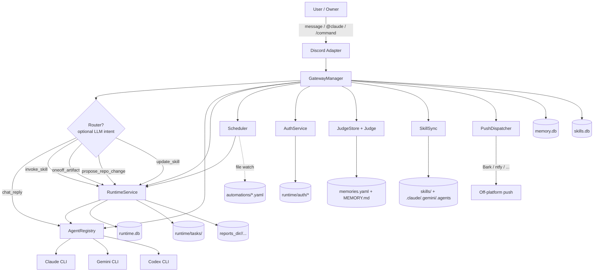
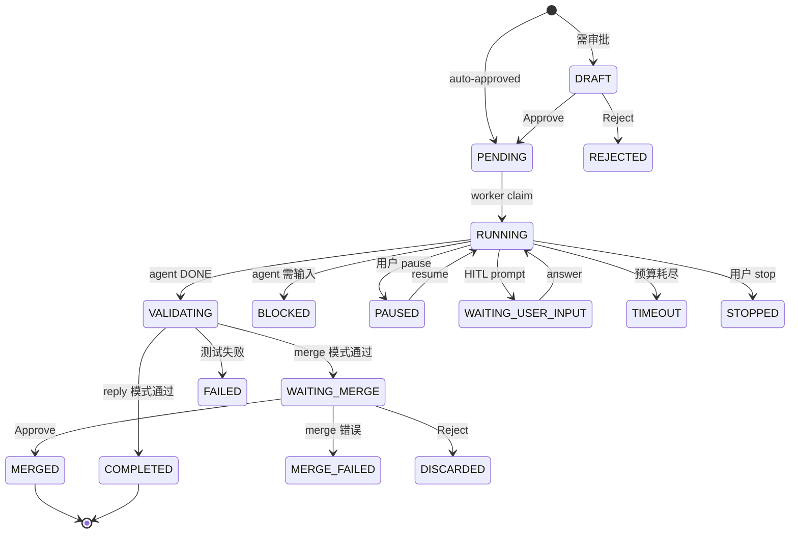

# Oh My Agent — Technical Overview

> 截图时间：2026-04-29 · 版本：v0.9.4 · 主分支：`main`
>
> 本文档是对当前 repo 的一份完整技术综述，覆盖项目定位、架构、粗/细粒度模块、关键技术决策与假设、当前限制以及未来规划。原始 repo 已经有非常翔实的 `docs/EN/` 与 `docs/CN/` 文档，本文是把它们 + `CHANGELOG.md` + 实际源码 (~28k 行 Python，80 个测试文件) 浓缩成一份单页技术索引。

---

## 1. 项目定位

**Oh My Agent (OMA)** 是一个**自托管、单租户、Discord 优先**的多平台 Bot，把 **CLI 形态**的 AI Agent (Claude Code、Gemini CLI、Codex CLI) 包装成长期在线、有持久化记忆、支持自治任务编排的服务。

### 核心定位

| 维度 | 选择 | 原因 |
|---|---|---|
| Agent 形态 | **CLI subprocess**，非 SDK 直连 | 与用户实际工作方式对齐；复用各厂商工具链；多 agent fallback 天然 |
| 部署模型 | **自托管 (venv 或 Docker)** | 单 owner，私人 bot；Docker compose 是默认运营路径 |
| 平台 | **Discord 单平台 (1.0)** | Slack stub 已在 v0.9.1 移除，平台扩展是 post-1.0 |
| 用户模型 | **owner-operated** | 单用户/单团队；`access.owner_user_ids` 强制 gate |
| 配置 | 文件驱动 (`config.yaml` + `~/.oh-my-agent/automations/*.yaml`) | 易编辑、易 diff、热重载 |
| 持久化 | **SQLite + YAML/Markdown** | 事务性状态进 SQLite，人可读/可编辑的留 YAML |

### 受 OpenClaw 启发

README 与代码注释中数次提到受 [OpenClaw](https://openclaw.dev) 启发。最直接的体现是 v0.7 时期的"日级 + 长期"双层记忆系统（已在 v0.9.0 被事件驱动的 Judge 模型重写替换）。

---

## 2. 高层架构

### 2.1 系统组件关系图



### 2.2 三条主要数据通路

```text
1) 直接对话 (chat path)
   message → IncomingMessage → GatewayManager → AgentRegistry.run() → channel.send()

2) 运行时任务 (runtime path)
   message → router/explicit → RuntimeService.create_*_task() → state machine → notify()

3) 自动化 (automation path)
   yaml file → Scheduler → fire_job() → handle_message() (system) → runtime/chat path
```

---

## 3. 七大子系统（粗粒度）

> 按代码量与责任面排序：runtime > memory > gateway > discord > automation > agents > skills。

| # | 子系统 | 主代码 | 行数 | 单一职责 |
|---|---|---|---|---|
| 1 | **Gateway** | `src/oh_my_agent/gateway/` | ~5500 | 平台适配、消息路由、会话管理、slash 命令、服务编排 |
| 2 | **Agents** | `src/oh_my_agent/agents/` | ~2700 | CLI 子进程封装、fallback、流式输出、session resume |
| 3 | **Memory** | `src/oh_my_agent/memory/` | ~5000 | 对话历史 + Judge 长期记忆 + 历史压缩 + 日记 |
| 4 | **Runtime** | `src/oh_my_agent/runtime/` | ~7300 | 自治任务状态机、worktree 隔离、HITL、merge gate、产物发布 |
| 5 | **Skills** | `src/oh_my_agent/skills/` | ~700 | 双向同步、frontmatter 校验、agent-driven creation |
| 6 | **Automation** | `src/oh_my_agent/automation/` | ~1400 | cron / interval 调度、热重载、watchdog、auto_approve |
| 7 | **Auth** | `src/oh_my_agent/auth/` | ~700 | QR 登录流程、OMA_CONTROL 协议、token 持久化 |

辅助子系统：

- **Router** (`gateway/router.py`) — OpenAI 兼容的可选 LLM 意图分类器
- **Push notifications** (`push_notifications/`) — 平台外推送 (Bark)，区别于 in-Discord 通知
- **Trace** (`trace/`) — opt-in 的 JSONL 工具调用审计
- **Sandbox** (`main.py` + `BaseCLIAgent`) — 三层 (cwd / env / CLI-native) 隔离

---

## 4. 各子系统细粒度

### 4.1 Gateway 层

#### 4.1.1 责任划分

`GatewayManager` 是协调层，**不**负责跑 agent、不负责执行 task。它是：

- `(BaseChannel, AgentRegistry)` 的容器
- `ChannelSession` 的池子（每 channel 一个）
- 消息流的总调度（router → explicit skill → runtime task → chat fallback）
- 后台任务的孵化器（history 压缩、idle judge、short-workspace 清理、scheduler 监督）

#### 4.1.2 ChannelSession

每 channel 一个，内部做：

- 每 thread 的对话历史缓存（避免重复读 DB）
- 持久化用户 turn / assistant turn 进 `MemoryStore`
- 对接 `IdleTracker` (15 分钟静默触发 Judge)
- 把 turn 同步进 `SessionDiaryWriter`（fire-and-forget）

#### 4.1.3 BaseChannel ABC

```python
class BaseChannel(ABC):
    supports_streaming_edit: bool = False  # Discord overrides True
    async def start(self) -> None
    async def create_thread(self, ...) -> str
    async def send(self, ..., text: str, files: list[Path] | None = None) -> str
    async def typing(self, channel_id: str) -> None
    async def create_followup_thread(self, anchor_message_id, name) -> str | None
```

`DiscordChannel` 是当前唯一实现，负责：

- `discord.py` Client 启动、`on_message` / `on_reaction_add`
- `app_commands.CommandTree` slash 命令注册
- 附件下载（image/* ≤10MB 到临时目录）
- 流式 anchor edit（v0.9.4 新增）
- `dump_channels` 别名（v0.9.4 新增 — 一个 bot token 多个 send-only channel）

#### 4.1.4 服务层（v0.8 / v0.9 抽离的核心）

`gateway/services/` 承担本来散落在 Discord adapter 里的业务逻辑，使得未来加 Slack/Feishu adapter 不需要复制 Discord-specific 业务分支：

| Service | 文件 | 职责 |
|---|---|---|
| `TaskService` | `task_service.py` | `/task_*` 系列的统一入口，含 decision event 派发 |
| `AskService` | `ask_service.py` | `/ask` 命令路径 |
| `DoctorService` | `doctor_service.py` | `/doctor` 健康快照 |
| `AutomationService` | `automation_service.py` | `/automation_*` |
| `MemoryService` | `memory_service.py` | `/memories`, `/forget`, `/memorize`, MEMORY.md 重合成 |
| `SkillEvalService` | `skill_eval_service.py` | `/skill_stats`, `/skill_enable`, 👍👎 reaction |
| `HITLService` | (内嵌) | DRAFT / WAITING_MERGE 上的 owner 决策 |

每个 handler 现在都是 **owner check → service call → render**，business logic 不再触碰 `JudgeStore` / `MemoryStore` 的 CRUD。

#### 4.1.5 Slash 命令矩阵

| 类别 | 命令 |
|---|---|
| 对话 | `/ask`, `/reset`, `/history`, `/agent`, `/search` |
| Runtime | `/task_start`, `/task_status`, `/task_list`, `/task_approve`, `/task_reject`, `/task_suggest`, `/task_resume`, `/task_stop`, `/task_merge`, `/task_discard`, `/task_replace`, `/task_changes`, `/task_logs`, `/task_cleanup` |
| Skills | `/reload-skills`, `/skill_stats`, `/skill_enable` |
| Automation | `/automation_status`, `/automation_reload`, `/automation_enable`, `/automation_disable`, `/automation_run` |
| Memory | `/memories`, `/forget`, `/memorize`, `/reflect_yesterday` |
| Auth | `/auth_login`, `/auth_status`, `/auth_clear` |
| Operator | `/doctor`, `/usage_today`, `/usage_thread` |

#### 4.1.6 Streaming（v0.9.4）

可选的"边写边显"模式（默认关）。`StreamingRelay` 在 agent 流式输出时把 partial text edit 进一条 anchor 消息：

- **Discord 速率约束**：`min_edit_interval_ms` 默认 1000ms，地板 500ms（Discord allows ~5 edits / 5s per message）
- **心跳**：3s 心跳 coroutine，placeholder 加 `(Ns)` 计时；首个 update / finalize 触发自动取消
- **工具轨迹**：单独 `-#` subtext 行渲染 `🔧 A · B · C (+N)`，与 model body 视觉分离
- **Resume 分支**：fresh + `--resume` 都走流式；图像消息仍 fall back 到 block 模式

---

### 4.2 Agent 层

#### 4.2.1 BaseAgent → BaseCLIAgent → 三个具体 Agent

```text
BaseAgent (ABC)
    └─ BaseCLIAgent (subprocess 通用基类)
        ├─ ClaudeAgent     (.claude, --resume)
        ├─ GeminiCLIAgent  (.gemini, --yolo, JSON output)
        └─ CodexCLIAgent   (.agents, --full-auto, JSONL events)
```

#### 4.2.2 BaseCLIAgent 的关键设计

- **workspace 参数**：`Path | None`。设了就是 sandbox 模式，subprocess `cwd=workspace`；没设就是后向兼容模式。
- **passthrough_env**：白名单列表，secrets 显式声明才能注入子进程。
- **`_oma_agent_home` 类属性**：`.claude` / `.gemini` / `.agents` — 决定 `OMA_AGENT_HOME` 环境变量的值，Skill 脚本里 `${OMA_AGENT_HOME}/skills/<name>/scripts/...` 才能正确解析。
- **流式与回调**：`on_partial`, `on_tool_use` 通过 `inspect.signature` gate，老 agent 没这个 kwarg 也不会炸。
- **error_kind 分类**：`max_turns`, `timeout`, `rate_limit`, `api_5xx`, `auth`, `cli_error` — 决定 retry policy 和是否 fallback 下一个 agent。

#### 4.2.3 AgentRegistry — fallback 策略

```text
config 顺序: [claude, codex, gemini]
  → AgentRegistry.run()
    → 按顺序尝试每个 agent
    → 成功就返回；失败 (error_kind 终态) 才尝试下一个
    → force_agent (preferred_agent) 跳过 fallback

retry 在哪里？
  - 在每个 agent 内部：rate_limit / api_5xx / timeout 走 _invoke_agent_with_retry
  - 跨 agent：终态 error_kind 直接 fallback，不重试
```

`AgentRegistry._temporary_max_turns` / `_temporary_timeout` 让 `/task_suggest` 的 budget override 不需要重启就生效（per-call basis）。

#### 4.2.4 Session resume

| Agent | 机制 |
|---|---|
| Claude | `--resume <session_id>`，session ID 从 `system.init` 事件提取 |
| Gemini | session ID 从 `--output-format json` 单行 JSON 的 `session_id` 字段 |
| Codex | session ID 从 JSONL 的 session 事件提取 |

session ID 持久化到 `runtime.db.agent_sessions` 表，主键 `(platform, channel_id, thread_id, agent)`。`GatewayManager` 在每条消息处理时加载并 upsert/delete。

#### 4.2.5 图像处理（per-agent）

| Agent | 方法 |
|---|---|
| Claude | 复制图到 `workspace/_attachments/`，prompt 里附 file reference 指令 |
| Gemini | 同上 |
| Codex | 原生 `--image <path>` 参数 |

无文本但有图的消息会注入默认分析 prompt。

---

### 4.3 Memory 层

整个 memory 系统在 v0.9.0 经历过一次大重写：从"日级 + 长期"双层 + 每轮触发的 extractor，改成单层 `memories.yaml` + 事件驱动的 Judge agent。原因：旧系统因为 paraphrase-driven duplication 导致条目永远停在 `obs=1`。

#### 4.3.1 三层物理存储

```text
~/.oh-my-agent/
├── runtime/memory.db        ← turns + summaries + turns_fts (FTS5)
├── runtime/runtime.db       ← agent_sessions + tasks + auth + HITL + ...
├── runtime/skills.db        ← skill provenance, invocations, feedback
└── memory/
    ├── memories.yaml        ← Judge 写入的单层记忆
    └── MEMORY.md            ← agent 合成的自然语言版本
```

物理拆 SQLite 是为了**写入热点隔离**：聊天历史、任务控制、skill 遥测三个写入面分开避免互相阻塞 WAL。

#### 4.3.2 MemoryStore (SQLite)

- WAL mode + FTS5 全文搜索
- thread-level CRUD（`/reset`, `/history`, `/search` 都靠它）
- `export_data()` / `import_data()` 备份恢复
- 启动时自动从老的单文件 monolithic DB 拆分迁移

#### 4.3.3 HistoryCompressor

- 阈值：`memory.max_turns: 20`（默认）
- 压缩方式：调用一个 agent 写 summary（`summary_max_chars: 500`），fallback 是简单截断
- **关键顺序**：先做 memory extraction (Judge)，再做 compression — 防记忆丢失

#### 4.3.4 JudgeStore + Judge — 事件驱动长期记忆

```yaml
# memories.yaml 单条
- id: <uuid>
  summary: <natural language sentence>
  category: preference | workflow | project_knowledge | fact
  scope: global_user | workspace | skill | thread
  confidence: 0.0–1.0
  observation_count: int
  evidence_log:
    - thread_id: ...
      ts: ...
      snippet: ...   # ≤140 chars
  source_skills: [...]
  source_workspace: ...
  status: active | superseded
  superseded_by: <other_id>
  created_at: ...
  last_observed_at: ...
```

**触发器**（三种，全收敛到 `Judge.run()`）：

1. **Idle 15 分钟**：`IdleTracker` 后台 polling，per-thread 静默 ≥ `idle_seconds` (default 900) 触发
2. **`/memorize [summary] [scope]`**：显式调用，带 summary 短路 LLM 步骤
3. **自然语言关键词**：`记一下` / `remember this` / 等，可配 `keyword_patterns`

**Judge 动作 schema**（agent 必须返回这四种之一）：

- `add` — 创建新条目
- `strengthen` — observation_count++ 并追加 evidence
- `supersede` — 旧 → 新链式替换
- `no_op` — 必填，没东西保存时也得显式说

**注入策略**：每次 agent 调用前注入 `[Remembered context]` 块，`get_relevant()` 按 4-bucket（skill_scoped / workspace_project / global_preference / recent_daily）排序，scope 匹配有 multiplier，`status=superseded` 永不注入。

#### 4.3.5 SessionDiaryWriter

- 每天一个 `runtime/diary/YYYY-MM-DD.md`，append-only
- `ChannelSession.append_user/append_assistant` fire-and-forget enqueue
- 单 worker drain 队列，写入永不交错
- **operator-only 可见**，agent 永不读回 — 仅供运维审计

#### 4.3.6 DiaryReflector（可选，默认关）

每日 02:00 本地时间读昨天的 diary，把 `Judge` actions 喂回 store，做跨日反思。

---

### 4.4 Runtime 层

这是整个 repo 最复杂的子系统（service.py 单文件 6415 行）。

#### 4.4.1 三种 Task Type

| Type | 完成模式 | 是否合并 | 工作目录 | 典型场景 |
|---|---|---|---|---|
| `artifact` | `reply` | 否 | `_artifacts/<task_id>/` (清理) | 报告、研究、digest |
| `repo_change` | `merge` | 是 | git worktree (`<task_id>/`) | "fix X" / "refactor Y" |
| `skill_change` | `merge` | 是（可 auto） | git worktree | "create skill" / "fix the X skill" |

#### 4.4.2 17 个状态的状态机



#### 4.4.3 Per-task 隔离

- 每个 repo_change / skill_change 任务一个 git worktree (`runtime/tasks/<task_id>/`)
- 工作完成后通过 patch 应用回主 repo
- artifact 任务用 `_artifacts/<task_id>/` 临时目录
- **隔离的副作用**：`agent_workspace` 提供的 `.venv` / `.claude/skills/` / `.gemini/skills/` / `.agents/skills/` 通过 `_link_agent_workspace_into()` symlink 进任务目录（v0.9.4 修复，不然 agent 会浪费 8-15 turn 找 `find / -name SKILL.md`）

#### 4.4.4 真正的子进程中断

`_invoke_agent` 里有 heartbeat loop：

- 默认每 20s 检查一次任务状态
- 看到 PAUSED / STOPPED 时 cancel 正在跑的 agent / test 子进程
- PAUSED 是非终态，workspace 保留，可 resume + instruction

#### 4.4.5 消息驱动的控制

`_parse_control_intent(text)` 从普通 thread 消息识别 `stop` / `pause` / `resume`，不需要走 slash 命令。

#### 4.4.6 失败恢复：retry + rerun

**透明 retry by error_kind**：

| error_kind | 动作 | 回退 | 上限 |
|---|---|---|---|
| `success` | return | — | — |
| `rate_limit` | retry | 10s → 30s | 2 次 |
| `api_5xx` | retry | 5s → 15s | 2 次 |
| `timeout` | retry once | 0s | 1 次 |
| `max_turns` | **terminal** | — | 0（弹"+30 turns"按钮）|
| `auth` | **terminal** | — | 0（触发 auth notification）|
| `cli_error` | **terminal** | — | 0（fallback 下一个 agent）|

- 跨 agent 的 retry 总上限：`_MAX_TOTAL_RETRIES = 3`
- claude → codex fallback 时 retry 计数器重置

**"Re-run +30 turns" button**：`max_turns` failure 时，`_fail` 张贴一个交互按钮，点击后克隆 sibling task，`agent_max_turns = parent + 30`，emit `task.rerun_sibling_created`。

#### 4.4.7 单一发布产物路径

`completion_mode=reply` 时，每个文件**唯一**地发布到 `runtime.reports_dir/...`：

| 规则 | 源 | 目标 | 冲突处理 |
|---|---|---|---|
| 1 | 已在 `reports_dir/` 下且不在 task workspace | 原地复用 | — |
| 2 | `workspace/reports/<sub-tree>/...` | `reports_dir/<sub-tree>/...` 保结构 | overwrite in place（同 canonical = 同逻辑文件）|
| 3 | workspace 其他位置 | `reports_dir/artifacts/<basename>` | basename 冲突加 `-<task_id[:8]>` |
| 4 | 绝对路径 (artifact_manifest) | 同 (3) | 同 (3) |

完成消息 `Published to:` 是主路径，`Delivered via:` / scratch dir 降为副标签。

**关键不变量（v0.9.4 修复）**：reply / artifact 路径上 `_notify` 在 DB row 翻 COMPLETED **之前**就发出。任何看到 `status=COMPLETED` 的 poller 保证 channel message 已落地。`_notify` 失败的 task 标 FAILED 加 `error=notification_failure: ...`，emit `task.notification_failed`，且 `summary` / `output_summary` / `artifact_manifest` 持久化好以备后续 manual resend。

#### 4.4.8 Janitor 清理

- 默认 retention：`168 小时` (7 天)
- 清理 `runtime/tasks/<task_id>/` 和 `runtime/logs/agents/<...>`
- `reports_dir/` **永不**自动清理（运维需自己定期 sweep）

---

### 4.5 Skill 系统

#### 4.5.1 双向同步

```text
canonical: skills/<name>/SKILL.md (+ scripts/)
    ↓ forward sync (sync())                    ↑ reverse sync (reverse_sync())
.claude/skills/<name>/                        agent 在 CLI 目录创建的新 skill
.gemini/skills/<name>/                        会被拷贝回 canonical
.agents/skills/<name>/

workspace/.claude/skills/<name>/      ← 这里是真文件拷贝（agents 跑在 workspace cwd）
workspace/.gemini/skills/<name>/
workspace/.agents/skills/<name>/
```

启动时 `full_sync()` = 先 `reverse_sync()` 再 `sync()`，保证 agent 现场创建的 skill 不会丢。

#### 4.5.2 Agent-driven Skill Creation

- 每次 response 后 `_try_skill_sync()` 检测 workspace 里的新 skill 目录
- 自动 `full_sync()`、`SkillValidator` 校验、Discord 通知
- Validator 检查：frontmatter 必填字段（name + description）、脚本语法、可执行权限

#### 4.5.3 内置 Skills（11 个）

| Skill | 用途 |
|---|---|
| `market-briefing` | 中文优先的政治/财经/AI 市场简报，含播客整合（`xiaoyuzhoufm.com` + YouTube）|
| `paper-digest` | 每日 arXiv + HuggingFace + Semantic Scholar 论文雷达（中文）|
| `youtube-video-summary` | 单链 YouTube 视频摘要 |
| `youtube-podcast-digest` | 每周订阅频道的 podcast digest |
| `bilibili-video-summary` | B 站视频摘要（带 cookie auth fallback）|
| `deals-scanner` | 中文优先的美卡/Rakuten/Slickdeals/Dealmoon 优惠扫描 |
| `seattle-metro-housing-watch` | 西雅图都会房市快照与深度（7 区，Redfin + Zillow 双源）|
| `scheduler` | 创建/更新/校验 automation YAML jobs |
| `skill-creator` | Skill 创建脚手架与指南 |
| `adapt-community-skill` | 把社区/外部 skill 改写成本仓库约定 |
| `jensen-huang-speech-research` | 特定 research skill |

#### 4.5.4 SKILL.md 元数据

```yaml
---
name: my-skill
description: ...
metadata:
  timeout_seconds: 1500   # 在 automation 触发时透传给 task agent_timeout_seconds
  max_turns: 60           # 在 automation 触发时透传给 task agent_max_turns
---
```

#### 4.5.5 Skill 治理

- **outcome tracking**：成败、延迟、token usage 进 `skills.db.skill_invocations`
- **user feedback**：第一条归属于 skill 的 response 上的 👍 / 👎 reaction → 持久化 rating
- **auto-disable**：滚动 20 次中失败率 ≥ 60% → 从自动路由摘掉，保留 `/<skill-name>` 显式调用
- **overlap guard**：自动 merge 新 skill 前，name/description 与现有 skill 比相似度（默认阈值 0.45）→ 强制人工 review
- **source-grounded review**：当 skill 改编自外部 repo/工具时，强制源元数据 + review 再 merge

---

### 4.6 Runtime（路由 / 决策面）

#### 4.6.1 OpenAI 兼容 Router

- 可选（默认关）
- 默认指向 `deepseek-chat`，可换 reasoner（`deepseek-reasoner`，~3x 延迟）
- **canonical 5-intent set** (v0.9.4)：

| Intent | 含义 | 入口 |
|---|---|---|
| `chat_reply` | 普通回复 | `AgentRegistry.run()` 直走 |
| `invoke_skill` | 调用已知 skill | `RuntimeService.create_artifact_task(skill_name=..., auto_approve=True)` |
| `oneoff_artifact` | 一次性产物任务 | `create_artifact_task()` |
| `propose_repo_change` | 代码变更 | `create_task(task_type=repo_change)` |
| `update_skill` | 创建或修复 skill | dispatcher 用 `skill_name` 是否已注册决定 create vs repair |

旧 6/7 个名字（`reply_once` / `invoke_existing_skill` / `propose_artifact_task` / `propose_repo_task` / `create_skill` / `repair_skill`）作为 alias 保留，`normalize_intent()` 在解析时转换。

#### 4.6.2 双阈值

```yaml
router:
  confidence_threshold: 0.55     # 低于这个 → heuristic fallback (chat path)
  autonomy_threshold: 0.90       # update_skill 自动跑只在这之上；之间走 DRAFT
  require_user_confirm: true     # borderline 强制 user 确认（已不再是 dead config）
```

---

### 4.7 Automation 层

#### 4.7.1 文件驱动

每个 automation 一个 YAML 文件，放在 `~/.oh-my-agent/automations/`。轮询热重载（默认 5 秒），不需重启。

```yaml
name: daily-ai-briefing
enabled: true
platform: discord
channel_id: "${DISCORD_CHANNEL_ID}"
target_channel: oma_dump        # 可选，把完成消息路由到 dump channel
prompt: "Run the market-briefing skill for today's AI digest."
agent: claude
skill_name: market-briefing      # 用于继承 SKILL.md 的 timeout_seconds / max_turns
cron: "0 9 * * *"
auto_approve: true               # 跳过 risk eval；DRAFT → 直接 PENDING
timeout_seconds: 1500            # 显式 override
```

#### 4.7.2 中央 due scanner（v0.9.4）

替换了原来"一 task 一 long-sleeper"模型。改为：

- 单一 due loop，每 ≤30s tick 一次
- 读 wall clock，dispatch `next_fire_at` 已过的 job
- **关键好处**：host suspend (Mac 笔电休眠) 后能在一个 tick 内恢复，老模型会被 watchdog 静默跳过
- **No-backfill** 语义不变：每个 overdue 窗口只 fire 一次

#### 4.7.3 Per-job 单实例

同一个 automation name 同时只允许一个 in-flight task。重叠触发 → skip 不 queue。

#### 4.7.4 Watchdog（v0.9.2）

`GatewayManager._run_scheduler_supervisor()` 每 60s 检查：

- 规则 A：task completed unexpectedly while `_stop_event` not set
- 规则 B：`phase=="sleeping"` 超过 `next_fire_at + grace`，且 `last_progress_at` 也老
- 命中就 `restart_job(reason)` / `restart_reload_loop(reason)`，且有 `min_restart_interval_seconds=120` 速率限制和 re-entry guard

`/doctor` 的 "Scheduler liveness" section 暴露这些信号。

#### 4.7.5 Dump Channels（v0.9.4）

```yaml
automations:
  dump_channels:
    oma_dump:
      platform: discord
      channel_id: "${DISCORD_OMA_DUMP_CHANNEL_ID}"
```

automation YAML 设 `target_channel: oma_dump` → 只有**完成 terminal 消息** + `automation_posts` row 落到 dump channel；DRAFT / 审批 / 进度 traffic 留源 channel。一个 bot token 只能开一个 gateway connection，所以 dump channel 共享源 channel 的 `DiscordChannel`，是 send-only alias。

#### 4.7.6 Follow-up Thread

每条 automation 发出的 channel 消息都进 `automation_posts` 表（7 天 TTL）。回复这条消息触发 Discord thread 创建（root 在那条消息上），seed 一个 system turn 列出原 run 的 published artifact 路径。Agent 在 thread 里继续聊天 — **CLI session 不 resume**，artifact path 作为上下文注入。

---

### 4.8 Auth / HITL / Push Notification

#### 4.8.1 Auth Service

- Bilibili QR 登录是当前唯一的 provider 实现
- 流程：`OMA_CONTROL auth_required` 控制信号 → Discord 张贴 QR + 进度 → user 完成登录 → 阻塞的 agent run 续跑
- 持久化在 `~/.oh-my-agent/runtime/auth/`
- Auth 仍走自己的 `suspended_agent_run` 路径，没有迁移到通用 `hitl_prompts`（list 在 limitation）

#### 4.8.2 HITL (Human-in-the-Loop)

通用单选挑战（`OMA_CONTROL ask_user`）：

- DB 持久化 `hitl_prompts` 表
- Discord 按钮渲染选项
- owner-only 响应
- 重启时按钮 view rehydrate（`_rehydrate_hitl_prompt_views`）
- 范围：单选；free-text / 多选都是 post-1.0

预设 choice family:

```python
HITL_CHOICES_APPROVAL = (approve, request_changes, cancel)
HITL_CHOICES_CONTINUE = (continue, stop)
```

#### 4.8.3 Push Notifications (v0.9.4)

**与 in-Discord notification 区别**：这是 off-platform push，OS 级别 focus / DND 模式压不住。

- Provider：Bark（已实现），ntfy / wecom / feishu 在路上
- 6 个事件类型，per-event allow-list + per-event Bark level
- `BarkPushProvider` 用 stdlib `urllib.request` + `asyncio.to_thread`，不引新依赖
- device key 从 env var 读，**永不**进 YAML
- 默认全关，`enabled: false`

| Event Kind | 触发位置 |
|---|---|
| `mention_owner` | Discord `on_message` mention peek before owner gate |
| `task_draft` / `task_waiting_merge` / `ask_user` | `NotificationManager.emit()` 后扇出 |
| `automation_complete` / `automation_failed` | RuntimeService 终态，仅当 `task.automation_name` 设了才 fire |

---

### 4.9 Sandbox 隔离

激活方式：在 `config.yaml` 设 `workspace: ~/.oh-my-agent/agent-workspace`。

| Layer | 机制 | 文件 |
|---|---|---|
| **0 — workspace cwd** | `_setup_workspace()` 创建目录、复制 AGENTS.md/CLAUDE.md/GEMINI.md（v0.9.4 三份相同 hint files）+ skills 副本；`BaseCLIAgent` subprocess `cwd=workspace` | `boot.py` |
| **1 — env 白名单** | `_build_env()` 用 `_SAFE_ENV_KEYS` (`PATH`, `HOME`, `LANG`, …)；secrets 只能通过 `env_passthrough` 显式列出才进 child env | `agents/cli/base.py` |
| **2 — CLI-native sandbox** | Codex `--full-auto`（network blocked）, Gemini `--yolo`, Claude `--dangerously-skip-permissions` + `--allowedTools` | 各 CLI agent |

不设 `workspace` 就是后向兼容模式（full env, process cwd）。

---

## 5. 持久化布局总览

```text
~/.oh-my-agent/
├── agent-workspace/              ← Layer 0 sandbox 根
│   └── sessions/                 ← short conversation 临时 workspace
├── automations/
│   └── *.yaml                    ← file-driven automation
├── memory/
│   ├── memories.yaml             ← Judge 单层记忆
│   └── MEMORY.md                 ← agent 合成的自然语言版
├── reports/                      ← 永久产物发布树（不自动清理）
│   ├── <skill-sub-tree>/...
│   └── artifacts/                ← flat fallback
└── runtime/
    ├── memory.db                 ← turns + summaries + FTS5
    ├── runtime.db                ← 任务 / auth / HITL / sessions / automation_posts
    ├── skills.db                 ← skill telemetry
    ├── auth/                     ← QR session token 落盘
    ├── diary/YYYY-MM-DD.md       ← session diary（operator-only）
    ├── logs/
    │   ├── agents/
    │   ├── threads/<thread_id>.log
    │   └── oh-my-agent.log
    ├── tasks/
    │   ├── _artifacts/<task_id>/   ← reply 模式临时
    │   └── <repo_change_task_id>/  ← git worktree
    └── traces/YYYY-MM-DD.jsonl     ← experiment.tool_trace（默认关）
```

---

## 6. 配置体系

### 6.1 顶层结构

```yaml
memory:          # SQLite + Judge + Diary
access:          # 可选 owner-only mode
notifications:   # 可选 off-platform push
auth:            # 可选 QR auth
workspace:       # 启用 sandbox isolation
short_workspace: # /ask 短会话临时 workspace
router:          # 可选 LLM intent router
automations:     # 调度器全局 + dump channels
runtime:         # autonomous task 编排
gateway:         # 平台 channels + streaming
agents:          # per-agent CLI 配置
experiment:      # opt-in 实验性（promote 到顶层时升级）
skills:          # 启用 + path
```

### 6.2 配置校验

`config_validator.py` 在启动时做 schema-level 检查：

- 必填字段、类型
- platform 白名单（`platform: slack` 现在直接报错指向 upgrade guide）
- 验证 `notifications.bark.device_key_env` 名字、env var 是否设
- CLI 二进制可达性（local 模式才检查）
- `--validate-config` flag exit 0/1，CI 友好

### 6.3 Env var 替换

所有 `${ENV_VAR}` 语法在 load 时替换。`.env` 通过 `python-dotenv` 自动加载。Secrets 只有显式列在 `agents.<name>.env_passthrough` 才会进子进程。

### 6.4 三层 timeout（认知陷阱）

| 层 | 字段 | 含义 |
|---|---|---|
| 外（runtime loop）| `runtime.default_max_minutes`, task 行 `max_minutes` | 单个 task 整个生命周期可用的总分钟数 |
| 中（per agent call）| `agents.<name>.timeout` | 单次 agent subprocess 调用的秒数（也用于 fallback 判定）|
| 内（skill 级 override）| SKILL.md `metadata.timeout_seconds` / `max_turns` | 通过 automation/skill 触发时，inner 层自动覆盖 |

`/task_suggest` 只能动 inner 层。看到 `step=1/8` 同时 `max_turns=30` 是正常的 — 8 是 outer，30 是 inner。

---

## 7. 关键技术决策与权衡

### 7.1 CLI-first 而非 SDK-first

**为什么**：复用真实的 Claude / Gemini / Codex 工具链，与用户日常工作方式对齐；多 agent fallback 天然；不会被某个 SDK 的 breaking change 绑架。

**代价**：

- 子进程编排比直接 SDK 调用脆弱
- Session resume 语义各厂商不同（不得不一个 agent 一个分支）
- 参数大小、进程生命周期需要显式管理
- 错误分类需要靠 stderr 文本启发式判定

### 7.2 文件驱动 automation

**为什么**：易编辑、易 git diff、易热重载；普通用户可以直接 vim YAML。

**代价**：

- scheduler 的可见 job snapshot 还是内存里的，重启时重建
- 非法/冲突文件主要靠 log 看到，operator UI 没完全暴露
- YAML 本身的 typo / 缺字段需要显式 validator 兜底

### 7.3 SQLite 三库拆分 + 文件记忆混合

**为什么**：

- 物理分离写热点：聊天历史 / 控制面 / skill 遥测三个域不互相阻塞 WAL
- SQLite 留给真正需要事务和 search 的地方
- YAML / Markdown 留给真人需要读写的记忆产物

**代价**：

- 控制面状态和人可读记忆产物之间有刻意冗余
- 启动迁移逻辑更复杂（老的单文件 monolithic memory.db 要拆三份）
- SQLite 仍不是 table-level multi-writer，拆库只是"分摊"，不是"并发"

### 7.4 Runtime 与 Direct Chat 分离

**为什么**：

- direct chat 应该便宜、快
- 自治任务需要 durable 状态、merge gate、recovery — 加 chat 路径里只会让两者都难做

**代价**：

- 现在有两个执行面，得保持行为一致
- auth 和 skill 感知 bug 经常出现在两者边界（典型：resumed CLI session 不立即看到新 skill）

### 7.5 Docker source-of-truth 模型

```text
/repo  ← code/config 真源（host 挂载）
/home  ← runtime state（host 挂载）
启动时容器把 /repo 装成 editable install
```

**为什么**：避免 image 里 stale source；live edit 重启可见；构建/运行职责显式分离。

**代价**：启动依赖挂载完整性；构建期 / 运行期责任边界要文档化清楚。

### 7.6 单一发布产物路径（v0.9.4）

**为什么**：之前 archive + workspace _artifacts 双套路径，用户不知道哪份"是真的"。新规则：每个文件唯一一个 published location 在 `reports_dir/`，scratch 是临时。

**代价**：canonical collision overwrite（同 `reports/<sub-tree>/...` 路径 = 同逻辑文件）— 是有意为之，但意味着两个无关 task 不能用同 sub-tree 同名。

### 7.7 COMPLETED post-notify watermark（v0.9.4）

**为什么**：之前 DB 翻 COMPLETED 早于 channel.send，poller 看到 COMPLETED 但消息没到 → 错误归类。现在 reply / artifact 路径上 `_notify` 先成功才翻 COMPLETED。

**代价**：merge flow (`WAITING_MERGE`) 和 `_fail` 路径仍有同样的 race，scope 之外没修。

### 7.8 Memory subsystem 重写为 Judge 模型（v0.9.0 BREAKING）

**为什么**：旧 extractor 每 turn 跑一次，paraphrase-driven duplication 把所有条目卡在 obs=1。Judge 看到现有 memories list 作为 context，能 explicitly add / strengthen / supersede / no_op，去重在源头解决。

**代价**：

- BREAKING：旧 daily/curated 双层、`/promote` 命令、`MemoryExtractor` 全部移除
- 老用户必须跑 `scripts/migrate_memory_to_judge.py`
- 触发器从"每 turn 跑"变"idle 15min / 关键词 / 显式触发"，意味着记忆"实时性"换成"质量"

---

## 8. 假设

明确写在 v1.0 plan 和代码里的假设：

1. **单 owner / owner-operated**：`access.owner_user_ids` 是当前的硬安全模型；多用户/多租户、guest mode 都是 post-1.0
2. **Self-hosted**：没有 hosted SaaS 的设想；secrets 全在用户 host
3. **Discord-only for 1.0**：Slack stub 已删；新平台 adapter 在 post-1.0 才做
4. **CLI 三件套之一可用**：Claude / Gemini / Codex 至少装一个；config_validator 启动时检查
5. **Network 假设**：CLI 子进程能连模型 API；某些 skill (`market-briefing`, `paper-digest`) 还需要外部 API；Bilibili skill 需要 cookie 持久化
6. **Resume CLI session 偶尔不识别新 skill**：明确文档化的当前 limitation
7. **Missed-job policy = skip**：固定，没有 catch-up；操作员用 `/automation_run` 手动补
8. **`reports_dir/` 不自动清理**：用户自己定期 `find ... -mtime +90 -delete`
9. **router threshold 0.55**：聊天里说"帮我研究 X"会被路由成 task；要 chat 就 disable router 或者改阈值
10. **Default budget `max_steps=8 / max_minutes=20`**：单轮报告够，多源研究偏紧；要么 per-automation 显式覆盖、要么 SKILL.md frontmatter

---

## 9. 当前限制（已知）

来自 `docs/EN/architecture.md` 的 Limitation section + `docs/EN/todo.md` 的 backlog：

- **Resumed CLI session 不立即识别新 skill** — agent 需要新 prompt/session context 才能感知，router/scheduler 立刻可见
- **Automation operator UI 只显示有效 visible automation** — 非法/冲突的文件主要靠 service.log
- **Generic HITL v1 是 Discord-only + 单选** — 自由文本 / 多选还没有
- **Auth 仍走自己专门的 suspended-run flow** — 没迁到通用 `hitl_prompts`
- **Lifecycle hooks (`pre-run` / `post-run` / `failure` / `resume`) 是 backlog** — 反向同步、产物后处理、observability 现在散落
- **CLI agent credential recovery** 不统一 — 401 / "login required" 各厂商不同，fallback loop 有时无意义
- **`_wait_for_status` test-helper race** — WAITING_MERGE 路径上 button nonce 需要 DB row 先写，channel.send 在 await 切换上有时落在 status 之后；workaround 已合，根因仍在
- **Worktree dev-loop ergonomics**：每个 worktree 需要手动 symlink config.yaml；prod config 污染风险（`docs/EN/dev-environment.md` 给了 SessionStart hook 解法）
- **Streaming 与 image 不能共存**：image 消息 fall back to block mode（argv 增强还没合进 streaming）
- **WAITING_MERGE / `_fail` 路径仍有 status-write 早于 notify 的 race**：reply / artifact 已修，merge 没修
- **Artifact workspace 不带 bundled skills**：`_artifacts/<id>/` 没 `.claude/skills/`，所以纯 artifact 任务调不了 skill；repo_change task **会**复制 skill

---

## 10. 测试覆盖

- 80 个测试文件，最新 changelog 提到 620+ tests
- `pytest-asyncio>=0.24` + `asyncio_mode = "auto"`
- CI 三阶段：`ruff check` → `mypy src` (68 文件 0 错误，无 per-module override) → `pytest -q`（约 1 分钟）
- 关键测试族：
  - `test_runtime_*` (state machine, retry, rerun, dispatch, worktree, notifications)
  - `test_judge*` / `test_idle_trigger` (memory subsystem)
  - `test_skill_*` (sync, validator, eval, task)
  - `test_router*` (canonical 5-intent + alias)
  - `test_automation_*` (state, refresh, posts, dump_channel, watchdog)
  - `test_restart_recovery.py` (in-process close/reopen 全流程)
  - `test_upgrade_paths.py` (migration scripts + schema 升级)
  - `test_v08_session1.py` (Slack rejection 等 contract lock)
  - `test_concurrent_isolation.py` (多 task 并发隔离)

---

## 11. 版本历史与未来规划

### 11.1 版本路径概览

| Version | 主题 | 状态 |
|---|---|---|
| v0.4.x | CLI-first cleanup, 多 agent fallback, slash commands | shipped |
| v0.5.x | Runtime 状态机、worktree、merge gate、janitor | shipped |
| v0.6.x | Skill-first 自治、Adaptive Memory MVP、CLI session resume | shipped |
| v0.7.x | Date-based memory、HITL/Auth/Operator 三件套、skill evaluation | shipped |
| **v0.8** | **1.0 Hardening**：service-layer 抽离、graceful shutdown、log 卫生、docker-compose | shipped |
| **v0.9.0** | **Memory rewrite (Judge model) — BREAKING**；老的 daily/curated 移除 | shipped |
| **v0.9.1–v0.9.3** | Contract Freeze：剩余 service 抽离、restart/recovery 测试、operator docs；artifact archive、自动化 follow-up | shipped |
| **v0.9.4 (current)** | Streaming、push notifications、watchdog、单一发布路径、dump channels、CI 三段 gate | shipped |
| **v1.0** | **稳定版**：契约冻结，acceptance criteria 全过 | 当前目标 |
| Post-1.0 / 1.x | 见 §11.4 | backlog |

### 11.2 v1.0 验收标准（12 项）

来自 `docs/EN/v1.0-plan.md`：

1. ✅ 全新安装在 venv 和 Docker/compose 下都能跑
2. ✅ 直接对话、显式 skill 调用、`artifact` / `repo_change` / `skill_change` 全 e2e 在 Discord 工作
3. ✅ HITL 审批 + auth 暂停跨重启幸存且能 resume
4. ✅ Automation 跨重启幸存，runtime state 持久化，遵守 documented `skip` policy
5. ✅ `/doctor`、task logs、automation 面板足以诊断坏掉的 run，不用 source-dive
6. ✅ Delivery 确定性：inline summary / attachment / 路径 fallback
7. ✅ Graceful shutdown 不损坏 active state
8. ✅ Config 校验失败要早+清晰
9. ✅ 跨版本升级有测试过的 migration
10. ✅ 并发 thread/task 互相隔离，恢复正确
11. ✅ Discord adapter 只做 input parsing / output rendering / SDK 调用 — 业务逻辑不在 adapter
12. ✅ 没有 1.0 acceptance 路径依赖 semantic retrieval / hybrid autonomy / guest mode / event triggers / 第二平台

### 11.3 v0.8 / v0.9 已完成

- v0.8 (1.0 Hardening): 全 4 阶段完成 — 平台抽象、可靠性、部署、文档
- v0.9 (RC / Contract Freeze): 全部完成 — service 抽离收口、restart/recovery 测试、experimental surface 清理、Slack stub 移除

### 11.4 Post-1.0 / 1.x（明确移到 1.0 critical path 之外）

| 类别 | 项目 |
|---|---|
| **Platform expansion** | Slack / Feishu / WeChat |
| **Semantic memory** | BM25 + vector hybrid、chunking、MMR re-ranking |
| **Hybrid autonomy** | 历史 pattern 检测、skill 自动草稿、统一运营面 |
| **Agent quality feedback** | per-turn quality signal、agent selection feedback、skill-agent affinity |
| **Trigger expansion** | webhook / file-watch / 外部通知触发 |
| **HITL families** | free-text、multi-select |
| **Delivery backends** | R2 / S3 远程对象存储 |
| **Tenancy** | guest session / per-user 隔离 |

### 11.5 No-version backlog（高价值待办）

- **Live observability ring buffer** + status-card live excerpt
- **Discord `/restart`**（host-managed container restart，安全 scope 待定）
- **Adaptive Memory 加密存储** + 认证后明文访问
- **CLI agent credential recovery 统一化**（401 / "login required" 各厂商分类 + auto/semi-auto re-login）
- **Lifecycle hooks**（pre-run / post-run / failure / resume）作为内部机制，不暴露给用户
- **Skill feedback UX 改进**：多 chunk skill response 上的 reaction、专门 feedback prompt
- **Automation concurrency 政策**：worker pool vs queue 语义、per-automation concurrency control
- **Automation follow-up CLI session resume**：把 CLI session id 存到 `automation_posts`，让 reply-trigger 能 `--resume`（artifact path injection 已覆盖常见 case）

---

## 12. 代码导航地图

| 目标 | 路径 |
|---|---|
| 入口 + boot | `src/oh_my_agent/main.py`, `boot.py` |
| 启动期配置校验 | `src/oh_my_agent/config_validator.py` |
| Gateway 总管 | `src/oh_my_agent/gateway/manager.py` |
| Discord adapter | `src/oh_my_agent/gateway/platforms/discord.py` |
| Service 层 | `src/oh_my_agent/gateway/services/` |
| Streaming relay | `src/oh_my_agent/gateway/stream_relay.py` |
| Router | `src/oh_my_agent/gateway/router.py` |
| AgentRegistry | `src/oh_my_agent/agents/registry.py` |
| CLI agent 通用基类 | `src/oh_my_agent/agents/cli/base.py` |
| Claude / Gemini / Codex | `src/oh_my_agent/agents/cli/{claude,gemini,codex}.py` |
| Runtime service | `src/oh_my_agent/runtime/service.py` (6415 行，主战场) |
| Runtime types | `src/oh_my_agent/runtime/types.py` |
| Runtime worktree mgr | `src/oh_my_agent/runtime/worktree.py` |
| Runtime risk policy | `src/oh_my_agent/runtime/policy.py` |
| HITL notifications | `src/oh_my_agent/runtime/notifications.py` |
| MemoryStore + FTS5 | `src/oh_my_agent/memory/store.py` |
| JudgeStore + Judge | `src/oh_my_agent/memory/judge_store.py`, `judge.py` |
| Idle Trigger | `src/oh_my_agent/memory/idle_trigger.py` |
| Compressor | `src/oh_my_agent/memory/compressor.py` |
| Diary | `src/oh_my_agent/memory/session_diary.py` |
| Skill sync | `src/oh_my_agent/skills/skill_sync.py` |
| Skill validator | `src/oh_my_agent/skills/validator.py` |
| Scheduler | `src/oh_my_agent/automation/scheduler.py` |
| Auth service | `src/oh_my_agent/auth/service.py` |
| Bilibili QR | `src/oh_my_agent/auth/providers/bilibili.py` |
| OMA_CONTROL 协议 | `src/oh_my_agent/control/protocol.py` |
| Push (Bark) | `src/oh_my_agent/push_notifications/bark.py` |
| Trace writer | `src/oh_my_agent/trace/trace_writer.py` |
| Markdown chunker | `src/oh_my_agent/utils/chunker.py` |
| Rate limiter | `src/oh_my_agent/utils/rate_limiter.py` |

---

## 13. 添加新东西的 SOP

### 13.1 添加新平台

1. 在 `src/oh_my_agent/gateway/platforms/<name>.py` 子类化 `BaseChannel`
2. 实现 `start` / `create_thread` / `send` / `typing` (+ 可选 `create_followup_thread`, `supports_streaming_edit`)
3. 在 `boot.py:_build_channel()` 加分支
4. 业务逻辑要走 `gateway/services/`，不要重新实现

### 13.2 添加新 CLI agent

1. 在 `src/oh_my_agent/agents/cli/<name>.py` 子类化 `BaseCLIAgent`
2. 重写 `_build_command()`，传 `workspace` + `passthrough_env` 给 `super().__init__()`
3. 设 `_oma_agent_home` 类属性
4. 在 `boot.py:_build_agent()` 加分支
5. `config.yaml` 引用 `type: cli` + `cli_path`

### 13.3 添加新 skill

1. 创建 `skills/<name>/SKILL.md` + 可选 `scripts/`
2. SKILL.md frontmatter 至少要 `name` + `description`，可加 `metadata.timeout_seconds` / `max_turns`
3. 启动或 `/reload-skills` 后 `SkillSync` 会同步到 `.claude/skills/` / `.gemini/skills/` / `.agents/skills/`，并复制到 workspace

### 13.4 添加新 automation

1. 创建 `~/.oh-my-agent/automations/<name>.yaml`
2. 必填 `name` + `enabled` + `platform` + `channel_id` + (`cron` 或 `interval_seconds`) + `prompt`
3. 推荐 `skill_name`（透传 timeout / max_turns）
4. 谨慎设 `auto_approve: true`（默认 false 走 strict risk eval）

---

## 14. 关键文件速读建议

如果想 30 分钟弄懂这个 repo，按这个顺序读：

1. `README.md` (5min) — 项目大全景
2. `docs/EN/architecture.md` (10min) — 高层架构 + 七大子系统 + 数据通路图
3. `docs/EN/task-model.md` (10min) — task 类型 / router intent / 状态机 / 失败恢复全集
4. `CHANGELOG.md` 头 200 行（5min） — 最近三个版本干了啥
5. 看代码：`gateway/manager.py:handle_message` → `runtime/service.py:_execute_task_loop` → `agents/cli/base.py:run` → `memory/judge.py:run`

---

## 附录 A：关键数字（at v0.9.4）

| 指标 | 值 |
|---|---|
| Python 源代码 | ~28,000 行 |
| Python 文件 | 68 个（mypy 全部 0 错误）|
| 测试文件 | 80 |
| Bundled skills | 11 |
| Slash 命令 | 30+ |
| Task 状态 | 17 |
| Task 类型 | 3 |
| Completion 模式 | 3 |
| Router intent (canonical) | 5 |
| HITL 选择族 | 2 (approval, continue) |
| Push event kinds | 6 |
| Sandbox layer | 3 |
| SQLite 库 | 3 (memory.db / runtime.db / skills.db) |
| 默认 retention | 168h (7 天) |
| 默认 router threshold | 0.55 |
| 默认 idle judge | 900s (15 min) |
| 默认 max_steps / max_minutes | 8 / 20 |

## 附录 B：术语表

| 术语 | 含义 |
|---|---|
| **OMA** | Oh My Agent |
| **owner** | 当前 1.0 contract 下唯一允许操作 bot 的用户 |
| **canonical skill** | `skills/<name>/` 是 source of truth，CLI 目录是 sync 出来的 |
| **dump channel** | send-only 的 alias channel，用于路由 automation 完成消息（v0.9.4）|
| **published path** | `reports_dir/...` 下的稳定产物路径，对比 ephemeral `_artifacts/<task_id>/` |
| **judge action** | `add` / `strengthen` / `supersede` / `no_op` 之一，必返其一 |
| **superseded** | 被新条目链式取代的 memory，永不再注入 |
| **scope (memory)** | `global_user` / `workspace` / `skill` / `thread` 之一 |
| **terminal error_kind** | `max_turns` / `auth` / `cli_error`，不 retry |
| **HITL** | Human-in-the-loop |
| **OMA_CONTROL** | agent → gateway 的控制协议（auth_required / ask_user 等）|
| **error_kind** | agent response 的失败分类，决定 retry/fallback 行为 |
| **fast/slow promotion** | 老的 memory 升级路径（v0.9.0 删除）|
| **DRAFT** | 等待审批的初始 task 状态（high-risk 自动落到这里）|
| **WAITING_MERGE** | merge gate 的等待状态（repo_change / skill_change 完成测试后）|

---

> 本文档基于 commit `4775bf1`（v0.9.4 release）撰写。后续版本以 `CHANGELOG.md` + `docs/EN/architecture.md` + `docs/EN/task-model.md` + `docs/EN/v1.0-plan.md` 为准。
