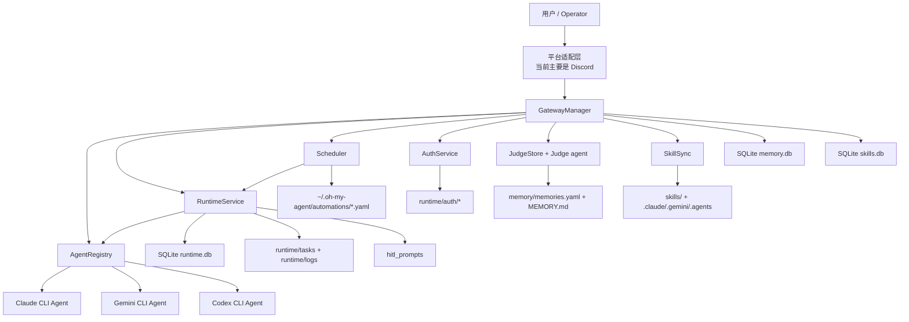
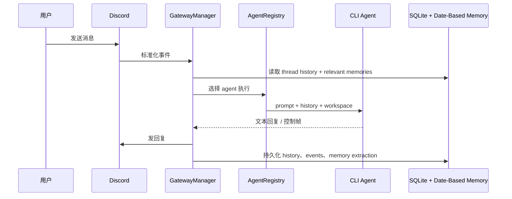
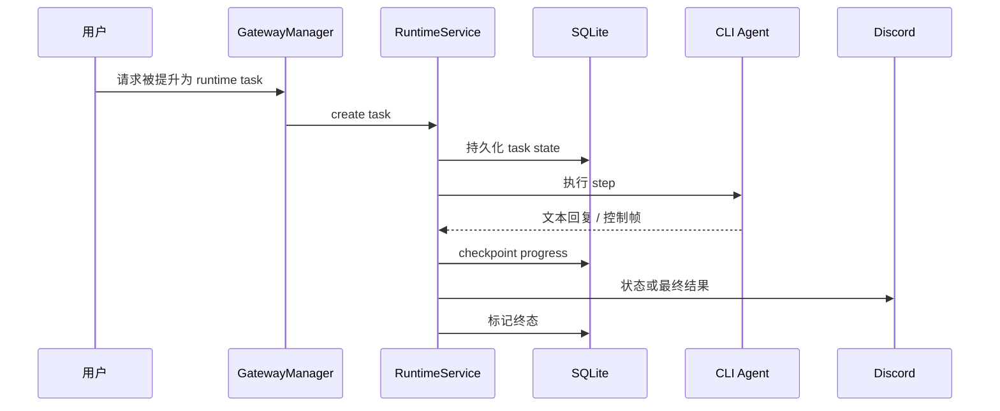
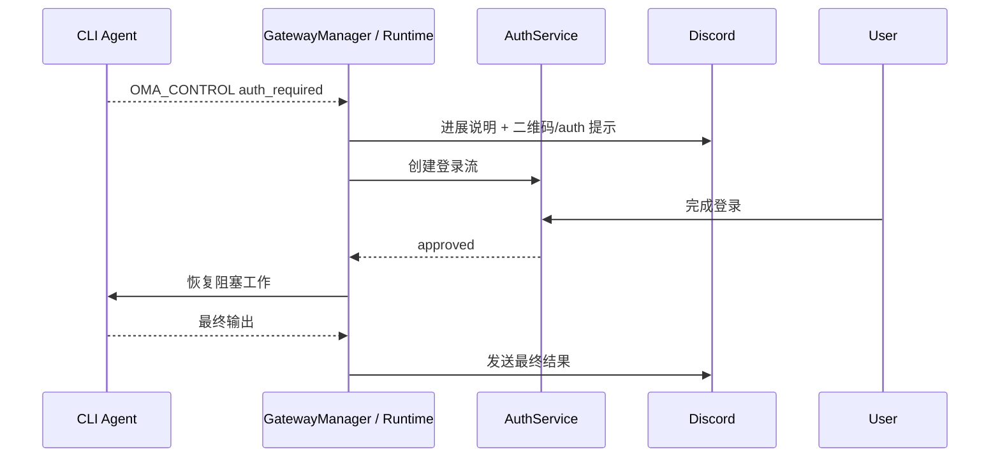
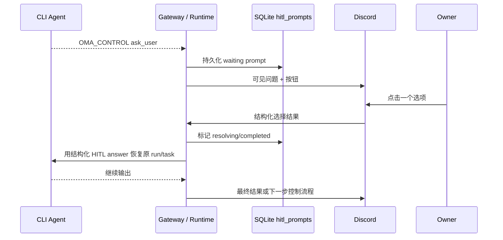
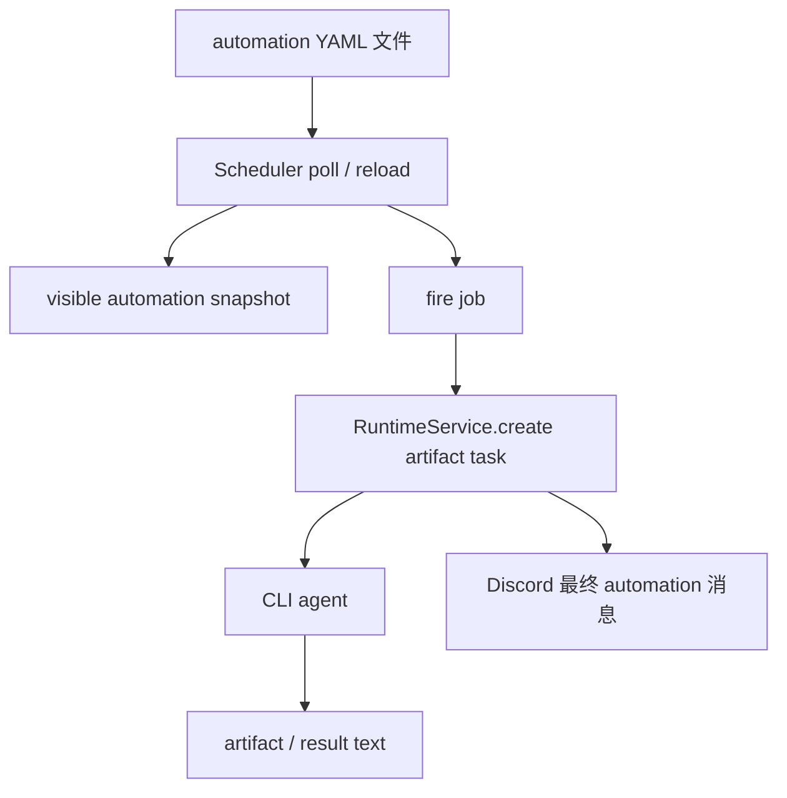

# 架构说明

本文档描述 `oh-my-agent` 当前 `main` 分支上的实际架构。

它优先解释今天真实存在的代码结构，而不是理想化的未来设计。

## 设计目标

- 保持 CLI agent-first，而不是 SDK agent-first。
- 把普通聊天处理和自主 runtime task 执行明确分开。
- 持久化足够的状态以支持重启恢复，但不把每个功能都做成重数据库子系统。
- 先把 operator 能力放到 Discord 里可操作。
- 对经常手改的对象（例如 automation、skills）优先采用文件驱动。

## 高层组件图



## 主要层次

### 1. Gateway

主要代码：

- `src/oh_my_agent/gateway/manager.py`
- `src/oh_my_agent/gateway/platforms/discord.py`

职责：

- 接收平台消息和 slash 命令。
- 维护按 thread / channel 隔离的交互状态。
- 把请求路由到三类路径：
  - 直接回复
  - 显式 skill 调用
  - runtime task 创建
- 提供 operator 命令，例如 task 控制、auth 控制、memory 命令、automation 命令。
- 运行 `agent-workspace/sessions` 的 short-workspace janitor。

Gateway 是协调层。它本身不直接执行 agent，也不负责长生命周期 automation 调度。

### 2. Agent Registry 与 CLI Agents

主要代码：

- `src/oh_my_agent/agents/registry.py`
- `src/oh_my_agent/agents/cli/*.py`

职责：

- 解析配置好的 agent fallback 顺序。
- 启动或恢复 Claude、Gemini、Codex 的 CLI session。
- 把 subprocess 输出流式返回给调用方。
- 在 provider 支持的情况下保存和恢复 session ID。

这个项目是刻意的 CLI-first。核心抽象假设 agent 是外部子进程，而不是进程内 SDK 模型。

### 3. Runtime Service

主要代码：

- `src/oh_my_agent/runtime/service.py`
- `src/oh_my_agent/runtime/types.py`

职责：

- 持有自主任务执行循环。
- 在独立的 runtime-state SQLite 库里持久化 task 状态。
- 重启后 requeue 未完成任务。
- 执行多步 task 状态迁移。
- 区分带 merge gate 的 repo work 和一次性 artifact work。
- 在 auth 发生时暂停任务，登录后恢复。
- 在 owner 需要做显式选择时暂停普通聊天或 runtime task，收到答案后恢复。
- 清理旧 runtime task workspace 和 agent logs。

当前 task 家族：

- `artifact`
- `repo_change`
- `skill_change`

一个重要的当前规则：

- scheduler 触发的 automation task 会被强制走轻量的 `artifact/reply` 路径，而不是 repo-change 路径。

### 4. Memory

主要代码：

- `src/oh_my_agent/memory/store.py`
- `src/oh_my_agent/memory/date_based.py`
- `src/oh_my_agent/memory/extractor.py`

职责：

- 在 `memory.db` 里保存 thread history 和 summaries。
- 在 `runtime.db` 里保存 runtime/auth/HITL/notification/session 状态。
- 在 `skills.db` 里保存 skill provenance 和 telemetry。
- 用 SQLite FTS 维护可搜索的对话历史。
- 用文件系统维护 daily + curated 两层 adaptive memory。
- 在 curated 变化时合成 `MEMORY.md`。

当前 memory 的拆分方式：

- `memory.db` 是对话库：`turns`、`summaries`、`turns_fts*`。
- `runtime.db` 是控制面库：runtime tasks、auth、HITL prompts、notifications、agent sessions。
- `skills.db` 是遥测/治理库：skill provenance、invocations、feedback、evaluations。
- YAML + Markdown 仍然是面向人可读、可编辑的长期记忆外层。

### 5. Skills

主要代码：

- `src/oh_my_agent/skills/skill_sync.py`

职责：

- 把 repo `skills/` 当作 canonical source。
- 同步到各 CLI 原生目录：
  - `.claude/skills`
  - `.gemini/skills`
  - `.agents/skills`
- 刷新 agent workspace 内的 skills 副本。
- 在需要时把原生目录中的兼容 skill reverse-import 回 canonical 位置。

### 6. Auth

主要代码：

- `src/oh_my_agent/auth/service.py`
- `src/oh_my_agent/auth/providers/*.py`
- `src/oh_my_agent/control/protocol.py`

职责：

- 启动 Bilibili 这类 provider 的登录流，例如二维码登录。
- 把 auth 产物保存在 `~/.oh-my-agent/runtime/auth/` 下。
- 通过 `OMA_CONTROL` 控制帧让 chat-path 或 runtime-path 的 agent 调用能请求登录，而不是直接把整个流程打崩。
- 在登录完成后恢复阻塞中的工作。

### 7. Automations / Scheduler

主要代码：

- `src/oh_my_agent/automation/scheduler.py`

职责：

- 从 `~/.oh-my-agent/automations/*.yaml` 加载文件驱动 automation。
- 维护 operator 命令可见的 automation snapshot。
- 轮询文件变化并热加载。
- 按两类调度触发 job：
  - `cron`
  - `interval_seconds`
- 通过修改 YAML 源文件来启用或禁用单条 automation。

现在 scheduler 是刻意的文件驱动设计。`config.yaml` 只保留 automation 的全局设置，不再内嵌 jobs。

## 关键执行路径

### 普通聊天路径



适用场景：

- 普通回复
- 不需要 runtime 的显式 skill 调用
- 遇到 auth_required 后能在原 thread 恢复的直接对话

### Runtime Task 路径



适用场景：

- `repo_change`
- `skill_change`
- scheduler 触发的 automation run

关键区别：

- `repo_change` 和 `skill_change` 可能进入 merge-oriented 状态。
- automation 的 artifact run 刻意限制为单步，并直接发最终结果。

### Auth 暂停 / 恢复路径



一个当前真实存在的限制：

- router 或 scheduler 可以从 canonical `skills/` 立即知道新 skill
- 但 resumed CLI session 可能暂时还“不认识”这个 skill，直到它获得更新鲜的 prompt 或新 session

这是现在真实存在的边界，不是文档上的理论问题。

### 通用 HITL `ask_user` 路径



当前 v1 边界：

- 只支持 Discord
- 只支持单选按钮
- 只允许 owner 回答
- prompt 默认不过期，直到 answered 或 cancelled
- 进程重启后会重新注册 active button views
- auth 仍然保持专用链路，不和 ask_user 共用一套存储模型

### Automation 路径



当前的保护措施：

- 热加载是轮询式，不是文件系统事件驱动
- 同一个 automation name 同时只允许一个 in-flight task
- 如果前一轮还没跑完，下一次触发会 skip，而不是无限堆积

## 存储布局

```text
~/.oh-my-agent/
├── agent-workspace/
│   └── sessions/               # 短对话 workspace
├── automations/
│   └── *.yaml                  # 文件驱动 automation 定义
├── memory/
│   ├── daily/YYYY-MM-DD.yaml
│   ├── curated.yaml
│   └── MEMORY.md
└── runtime/
    ├── auth/
    ├── logs/
    │   ├── agents/
    │   └── oh-my-agent.log*
    ├── tasks/
    │   ├── _artifacts/<task_id>/
    │   └── <repo-change-task-id>/
    ├── memory.db
    ├── runtime.db
    └── skills.db
```

各库职责：

- `memory.db`：对话历史 + FTS
- `runtime.db`：task/auth/HITL/notification/session 状态
- `skills.db`：skill provenance 和 telemetry

这次拆分的目标是把写热点和职责边界物理隔离。SQLite 依然不是按 table 粒度解决多写者并发的数据库；关键是不要再让 direct chat history、runtime queue 和 skill telemetry 一起挤在一个单体文件和一条连接上。

## Janitor 与清理机制

系统里现在有两套不同的 janitor。

### Runtime Janitor

归属：

- `RuntimeService`

处理对象：

- `runtime/tasks` 下的旧 task workspace
- `runtime/logs/agents` 下的旧 per-agent log

配置来源：

- `runtime.cleanup.*`

默认保留：

- `168` 小时（7 天）

### Short-Workspace Janitor

归属：

- `GatewayManager`

处理对象：

- `agent-workspace/sessions`

配置来源：

- `short_workspace.*`

这两套 janitor 刻意分开，因为 task 产物和短会话 workspace 的生命周期不同。

## 当前设计选择与取舍

### CLI-first，而不是 SDK-first

原因：

- 直接复用真实 Claude / Gemini / Codex 工具链
- 更贴近用户平时的工作方式

代价：

- subprocess 编排比直接调 SDK 更脆弱
- 不同 provider 的 session resume 语义不同
- 命令参数长度、进程生命周期等问题需要显式处理

### 文件驱动 automations

原因：

- 容易手改
- 容易做 Git diff 或直接在磁盘上排查
- 热加载模型清晰

代价：

- scheduler 的可见 job snapshot 仍然只保存在内存里，重启后会重建
- invalid / conflicting 文件现在仍主要通过日志暴露，而不是完整进入 operator UI

### 拆分后的 SQLite + 文件系统记忆混合模型

原因：

- 先把三类高频写入物理拆开：
  - 对话历史
  - runtime / control-plane 状态
  - skill 遥测
- SQLite 仍然适合操作态和搜索
- YAML / Markdown 更适合作为长期可读、可编辑的记忆外层

代价：

- 事务型运行状态和人类可读记忆之间仍然会有刻意的双层表示
- 启动迁移逻辑会更复杂，因为旧版单体 `memory.db` 需要安全拆分成三库

### Runtime 与 direct chat 分离

原因：

- direct chat 应该尽量轻量、快速
- autonomous task 需要 durable state、merge gate 和 crash recovery

代价：

- 现在存在两套执行表面，需要保持行为边界一致
- auth、skill 感知这类问题经常出现在两套路径的边界上

### Docker 里的 runtime source-of-truth 模型

当前设计：

- `/repo` 是代码和配置真源
- `/home` 是 runtime/state
- 容器启动时对 `/repo` 做 editable install

原因：

- 避免镜像里再维护一份会过期的源码副本
- 让重启后直接吃到挂载 repo 的最新代码

代价：

- 启动会依赖挂载 repo 的完整性
- build-time 和 run-time 职责被刻意拆开

## 当前限制

- resumed CLI session 不一定能立刻认出刚新增的 skill
- automation operator UI 目前只展示 valid 且 visible 的 automations，不展示 invalid/conflicting 条目
- 通用 HITL v1 目前只覆盖 Discord 单选按钮，还没有自由文本和多选
- auth 仍然沿用专门的 suspended-run 路径，而不是直接并入 `hitl_prompts`
- missed-job 策略固定为 `skip`；补跑靠 `/automation_run` 手动触发
- agent run 周围的 lifecycle hooks 目前还只是 backlog，还不是系统能力

## 代码入口索引

- 启动与装配：`src/oh_my_agent/main.py`
- Gateway：`src/oh_my_agent/gateway/`
- Agents：`src/oh_my_agent/agents/`
- Runtime：`src/oh_my_agent/runtime/`
- Memory：`src/oh_my_agent/memory/`
- Auth：`src/oh_my_agent/auth/`
- Automations：`src/oh_my_agent/automation/`
- Skills：`src/oh_my_agent/skills/`
