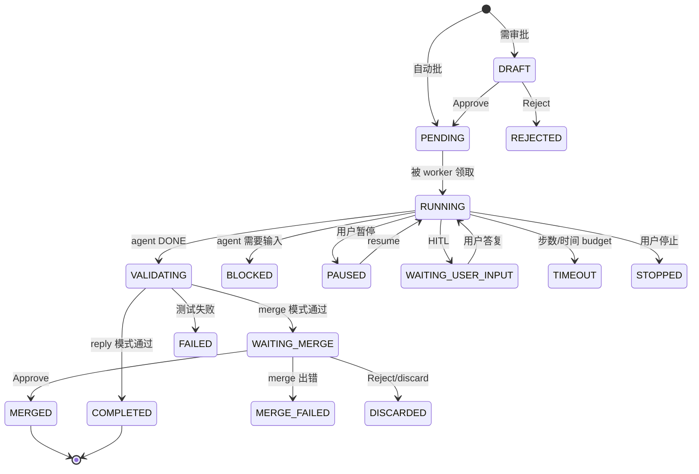

# 任务模型：类型、路由意图与状态机

Discord 消息 → runtime 任务的分类、类型与产物去向的统一说明。

---

## 1. Task type

定义在 [`src/oh_my_agent/runtime/types.py`](../../src/oh_my_agent/runtime/types.py)。

| 类型 | 常量 | Completion mode | 是否走合并 | 典型触发语义 | 工作目录 |
|---|---|---|---|---|---|
| `artifact` | `TASK_TYPE_ARTIFACT` | `reply` | 否 | 调研、报告、摘要等非代码变更类产物 | `~/.oh-my-agent/runtime/tasks/_artifacts/<task_id>/`（隔离目录，janitor 清理） |
| `repo_change` | `TASK_TYPE_REPO_CHANGE` | `merge` | 是 | 「修复 X」「重构 Y」「加测试 Z」等需要落到分支的改动 | `~/.oh-my-agent/runtime/tasks/<task_id>/` 下的独立 git worktree |
| `skill_change` | `TASK_TYPE_SKILL_CHANGE` | `merge` | 是（`skill_auto_approve: true` 时自动合） | 「新建一个 …skill」「修一下 deals skill」 | git worktree，变更落在 `skills/<name>/` |

`TASK_TYPE_CODE`、`TASK_TYPE_SKILL` 是历史兼容别名，仅用于读取老数据库行。

---

## 2. Completion mode

| 模式 | 常量 | 行为 |
|---|---|---|
| `reply` | `TASK_COMPLETION_REPLY` | Artifact 文件作为 Discord 附件发送到线程；完成消息包含 `Attachments:` 和 `Archived to:` |
| `artifact` | `TASK_COMPLETION_ARTIFACT` | 内部变体，直接外露较少 |
| `merge` | `TASK_COMPLETION_MERGE` | 任务进入 `WAITING_MERGE`，owner 在 Discord 点按钮或 `/task_merge` 触发合并 gate |

**归档行为（v0.9.3 准备中新增）**：`reply` 模式下每个 artifact 文件会被复制到 `<reports_dir>/<YYYY-MM-DD>/<filename>`。当天同名文件会在复制时追加 `-<task_id[:8]>` 后缀。把 `runtime.reports_dir` 设为 `""` 可关闭归档。

---

## 3. Router intent

定义在 [`src/oh_my_agent/gateway/router.py`](../../src/oh_my_agent/gateway/router.py)。Router 是可选的 LLM 分类器（`router.enabled: true`），位于消息分发之前。

| Decision | 映射到 | 阈值 | 说明 |
|---|---|---|---|
| `reply_once` | 不创建任务，普通对话 | — | 默认值，覆盖日常闲聊 |
| `invoke_existing_skill` | 调用已有 skill | `confidence_threshold`（默认 0.55） | 需返回 `skill_name` 能匹配到本地 skill |
| `propose_artifact_task` | `artifact` 任务 | ≥ 阈值 | 除非 strict-risk 命中，否则直接运行 |
| `propose_repo_task` | `repo_change` 任务 | ≥ 阈值 | 走 `evaluate_strict_risk()`，可能落入 `DRAFT` 等审批 |
| `create_skill` | `skill_change`（新建） | ≥ 阈值 | 需返回连字符小写 slug 作为 `skill_name` |
| `repair_skill` | `skill_change`（更新） | ≥ 阈值 | 当上下文已有近期使用的 skill 时优先采用 |

低于阈值会退化为 `reply_once`。`router.require_user_confirm: true`（默认开）会让 repo/skill 类任务先出一张确认 draft 再执行。

---

## 4. 状态机

17 个状态常量来自 [`src/oh_my_agent/runtime/types.py`](../../src/oh_my_agent/runtime/types.py)：

| 阶段 | 状态 |
|---|---|
| 创建 | `DRAFT` → `PENDING` |
| 执行 | `RUNNING` → `VALIDATING` → `APPLIED` → `COMPLETED` |
| 合并（repo / skill） | `WAITING_MERGE` → `MERGED`（或 `MERGE_FAILED`） |
| 人机交互 | `BLOCKED`、`PAUSED`、`WAITING_USER_INPUT` |
| 终止 | `COMPLETED`、`FAILED`、`TIMEOUT`、`STOPPED`、`REJECTED`、`DISCARDED` |



---

## 5. 消息 → 任务 的分发流程

```
Discord on_message
  ↓
IncomingMessage（含 attachments）
  ↓
GatewayManager.handle_message()
  ├── owner gate（若配了 access.owner_user_ids）
  ├── 若新线程则创建 thread
  ├── runtime.maybe_handle_thread_context()  （是否在回答 HITL？）
  ├── 显式 skill 调用？ (/<skill_name>)
  └── router enabled 且不是显式：
        router.route(content, context)
        │
        ├── reply_once           → 走聊天
        ├── invoke_existing_skill → skill 分发
        ├── propose_artifact_task → create_artifact_task()
        ├── propose_repo_task    → create_task(task_type=repo_change)
        ├── create_skill         → create_skill_task(new=True)
        └── repair_skill         → create_skill_task(new=False)
```

每个 `create_*_task` 调用都会走 `evaluate_strict_risk()`（除非显式 `auto_approve=True`）。Strict-risk 触发词（pip install、deploy、`.env` 改动、过大的 step/minute 预算）会把任务推入 `DRAFT`。

---

## 6. Artifact 交付链路

仅 `artifact` 任务：

1. Agent 把文件写在隔离 workspace（`_artifacts/<task_id>/…`）。
2. `_artifact_paths_for_task()` 按 `task.artifact_manifest` 或 `changed_files` 解析。
3. `_archive_artifact_files()` 把每个文件复制到 `<reports_dir>/<YYYY-MM-DD>/`。当日同名文件会被加 `-<task_id[:8]>` 后缀；失败只打 warning，不影响任务。
4. `deliver_files()` 用 Discord attachment 上传原始文件（`artifact_attachment_max_count` / `_max_bytes` / `_max_total_bytes` 作大小防线）。
5. 完成消息包含 `Attachments:` 和 `Archived to:`。上传失败时降级为 `mode="path"`，消息里会贴出绝对本地路径。
6. Janitor（`runtime.cleanup.retention_hours`，默认 168 h）最终会把 task workspace 删掉，但 `reports_dir/` 下的归档副本**不会**被自动清理。

---

## 7. 已知坑点

1. **Router 阈值 0.55 偏低。** 一句「帮我研究一下 X / let me research X」就能越线。如果想走聊天，要么临时关路由要么改措辞；或者把 `router.confidence_threshold` 调高，用 precision 换 recall。
2. **Artifact workspace 拿不到 bundled skills。** 隔离目录 `_artifacts/<id>/` 不会被 sync 进 `.claude/skills/` / `.gemini/skills/`，所以 artifact 任务跑的 agent 不能调用 `web-scraper` 这类本地 skill，只能在单轮内 inline 全部工作。（`repo_change` 任务会通过 `_setup_workspace()` 拿到 skills。）
3. **默认预算 `max_steps=8 / max_minutes=20`。** 单轮出报告够用，多源调研类任务会紧。可以在 automation 或 skill frontmatter 里 override，或者自定义代码传 `create_artifact_task(max_steps=…)`。
4. **静默降级为 `mode="path"`。** 附件上传失败（网络 / 超大）时完成消息会变成 `Delivery mode: path`，里面放绝对本地路径，在消息多的线程里容易被忽略。归档副本在 `reports_dir/` 里仍然在。
5. **归档目录不自动清理。** `reports_dir` 没有 retention，积累太多要手动扫（`find ~/.oh-my-agent/reports -mtime +90 -delete` 之类）。
6. **Docker 卷挂载路径。** 容器里归档落在 `/home/.oh-my-agent/reports/<date>/`；宿主机上一般是 `${OMA_DOCKER_MOUNT:-~/oh-my-agent-docker-mount}/.oh-my-agent/reports/<date>/`。

---

## 8. 相关配置 key

```yaml
runtime:
  worktree_root: ~/.oh-my-agent/runtime/tasks
  reports_dir: ~/.oh-my-agent/reports    # artifact 归档，设 "" 关闭
  default_max_steps: 8
  default_max_minutes: 20
  artifact_attachment_max_count: 5
  artifact_attachment_max_bytes: 8388608           # 单文件 8 MiB
  artifact_attachment_max_total_bytes: 20971520    # 总量 20 MiB

router:
  enabled: false
  confidence_threshold: 0.55
  require_user_confirm: true
```

完整配置见 [config-reference.md](config-reference.md)。
