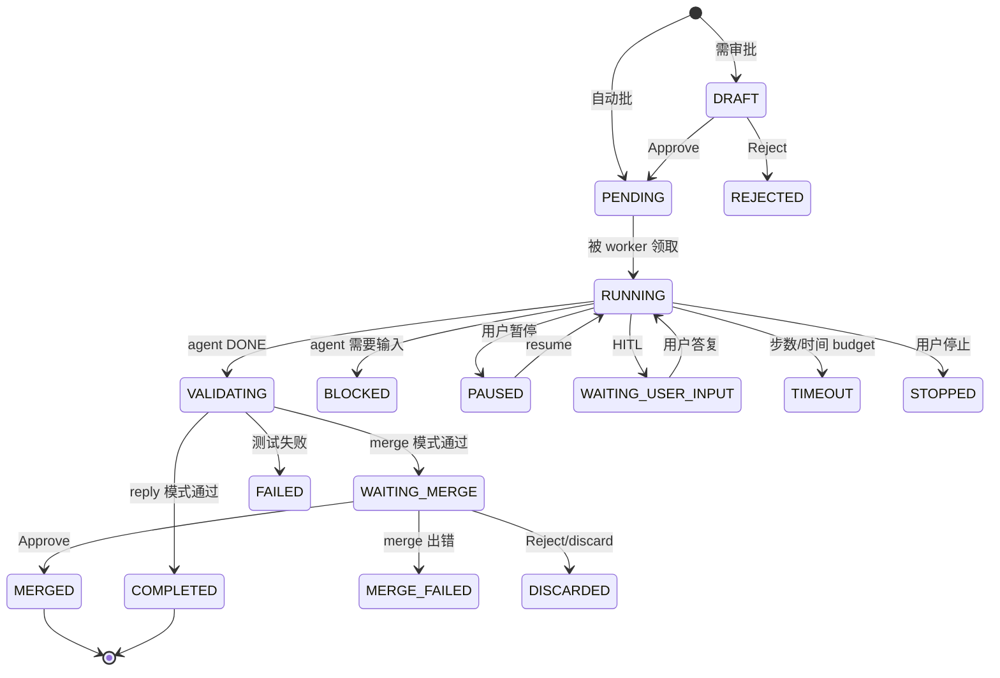

# 任务模型：类型、路由意图与状态机

Discord 消息 → runtime 任务的分类、类型与产物去向的统一说明。

---

## 1. Task type

定义在 [`src/oh_my_agent/runtime/types.py`](../../src/oh_my_agent/runtime/types.py)。

| 类型 | 常量 | Completion mode | 是否走合并 | 典型触发语义 | 工作目录 |
|---|---|---|---|---|---|
| `artifact` | `TASK_TYPE_ARTIFACT` | `reply` | 否 | 调研、报告、摘要等非代码变更类产物 | `~/.oh-my-agent/runtime/tasks/_artifacts/<task_id>/`（隔离目录，janitor 清理） |
| `repo_change` | `TASK_TYPE_REPO_CHANGE` | `merge` | 是 | 「修复 X」「重构 Y」「加测试 Z」等需要落到分支的改动 | `~/.oh-my-agent/runtime/tasks/<task_id>/` 下的独立 git worktree |
| `skill_change` | `TASK_TYPE_SKILL_CHANGE` | `merge` | 是（`skill_auto_approve: true` 时自动合） | 「新建一个 …skill」「修一下 deals skill」 | git worktree，变更落在 `skills/<name>/` |

`TASK_TYPE_CODE`、`TASK_TYPE_SKILL` 是历史兼容别名，仅用于读取老数据库行。

---

## 2. Completion mode

| 模式 | 常量 | 行为 |
|---|---|---|
| `reply` | `TASK_COMPLETION_REPLY` | Artifact 文件作为 Discord 附件发送到线程；完成消息把 `Published to:`（绝对路径）放在主位，`Delivered via:` / scratch 目录等 transport 细节作为次级信息 |
| `artifact` | `TASK_COMPLETION_ARTIFACT` | 内部变体，直接外露较少 |
| `merge` | `TASK_COMPLETION_MERGE` | 任务进入 `WAITING_MERGE`，owner 在 Discord 点按钮或 `/task_merge` 触发合并 gate |

**Publish 行为**：每个交付文件会被发布到 `runtime.reports_dir/...` 下**唯一**稳定位置。按以下四条规则顺序命中：

1. **原地复用** —— 如果源路径已经在 `reports_dir/` 下、且**不在** task workspace 下，直接把源路径作为已发布路径（不复制）。
2. **规范镜像** —— 源位于 `workspace_path/reports/<sub-tree>/…` 时，发布到 `reports_dir/<sub-tree>/…` 并保留子树结构。**规范碰撞直接就地覆盖，不追加后缀**（同一逻辑路径 = 同一个文件）。
3. **平铺 fallback（workspace 非 reports 前缀）** —— workspace 内但相对路径不以 `reports/` 开头的文件，落到 `reports_dir/artifacts/<basename>`。basename 碰撞时追加 `-<task_id[:8]>` 后缀。
4. **平铺 fallback（外部绝对路径）** —— 既不在 `workspace_path` 下也不在 `reports_dir` 下的绝对路径（罕见，例如 `artifact_manifest` 显式指向 worktree 外），按规则 3 的平铺策略落盘。

把 `runtime.reports_dir` 设为 `""` 可关闭 publish。`_artifacts/<task_id>/` 仍是 ephemeral scratch，由 janitor 清理；`reports_dir/` 下的 published 文件**不会**自动清理。

---

## 3. Router intent

定义在 [`src/oh_my_agent/gateway/router.py`](../../src/oh_my_agent/gateway/router.py)。Router 是可选的 LLM 分类器（`router.enabled: true`），位于消息分发之前。

| Decision | 映射到 | 阈值 | 说明 |
|---|---|---|---|
| `reply_once` | 不创建任务，普通对话 | — | 默认值，覆盖日常闲聊 |
| `invoke_existing_skill` | 调用已有 skill | `confidence_threshold`（默认 0.55） | 需返回 `skill_name` 能匹配到本地 skill |
| `propose_artifact_task` | `artifact` 任务 | ≥ 阈值 | 除非 strict-risk 命中，否则直接运行 |
| `propose_repo_task` | `repo_change` 任务 | ≥ 阈值 | 走 `evaluate_strict_risk()`，可能落入 `DRAFT` 等审批 |
| `create_skill` | `skill_change`（新建） | ≥ 阈值 | 需返回连字符小写 slug 作为 `skill_name` |
| `repair_skill` | `skill_change`（更新） | ≥ 阈值 | 当上下文已有近期使用的 skill 时优先采用 |

低于阈值会退化为 `reply_once`。`router.require_user_confirm: true`（默认开）会让 repo/skill 类任务先出一张确认 draft 再执行。

---

## 4. 状态机

17 个状态常量来自 [`src/oh_my_agent/runtime/types.py`](../../src/oh_my_agent/runtime/types.py)：

| 阶段 | 状态 |
|---|---|
| 创建 | `DRAFT` → `PENDING` |
| 执行 | `RUNNING` → `VALIDATING` → `APPLIED` → `COMPLETED` |
| 合并（repo / skill） | `WAITING_MERGE` → `MERGED`（或 `MERGE_FAILED`） |
| 人机交互 | `BLOCKED`、`PAUSED`、`WAITING_USER_INPUT` |
| 终止 | `COMPLETED`、`FAILED`、`TIMEOUT`、`STOPPED`、`REJECTED`、`DISCARDED` |



---

## 5. 消息 → 任务 的分发流程

```
Discord on_message
  ↓
IncomingMessage（含 attachments）
  ↓
GatewayManager.handle_message()
  ├── owner gate（若配了 access.owner_user_ids）
  ├── 若新线程则创建 thread
  ├── runtime.maybe_handle_thread_context()  （是否在回答 HITL？）
  ├── 显式 skill 调用？ (/<skill_name>)
  └── router enabled 且不是显式：
        router.route(content, context)
        │
        ├── reply_once           → 走聊天
        ├── invoke_existing_skill → skill 分发
        ├── propose_artifact_task → create_artifact_task()
        ├── propose_repo_task    → create_task(task_type=repo_change)
        ├── create_skill         → create_skill_task(new=True)
        └── repair_skill         → create_skill_task(new=False)
```

每个 `create_*_task` 调用都会走 `evaluate_strict_risk()`（除非显式 `auto_approve=True`）。Strict-risk 触发词（pip install、deploy、`.env` 改动、过大的 step/minute 预算）会把任务推入 `DRAFT`。

---

## 6. Artifact 交付链路

仅 `artifact` 任务：

1. Agent 把文件写在隔离 workspace（reply 模式任务落到 `_artifacts/<task_id>/…`；skill 类任务可能直接写在 worktree 内的 `reports/<skill>/…` 子树下）。
2. `_artifact_paths_for_task()` 按 `task.artifact_manifest` 或 `changed_files` 解析。
3. `_publish_artifact_files()` 按上面 §2 的四条 publish 规则发布：已在 `reports_dir` 下的原地复用；规范路径 `reports/<sub-tree>/…` 镜像到 `reports_dir/<sub-tree>/…`（覆盖，不加后缀）；其它 workspace 文件与外部绝对路径落到 `reports_dir/artifacts/<basename>`，basename 碰撞时加 `-<task_id[:8]>` 后缀。失败只打 warning，不影响任务。
4. `deliver_files()` 用 Discord attachment 上传原始文件（`artifact_attachment_max_count` / `_max_bytes` / `_max_total_bytes` 作大小防线）。
5. 完成消息把 `Published to: <绝对路径>` 作为主行，`Delivered via: <mode>`（以及可选的 `Scratch (ephemeral): _artifacts/<task_id>/` 标签）作为次级细节。上传失败时降级为 `mode="path"`，但 `Published to:` 仍指向 `reports_dir/` 下稳定绝对路径。
6. Janitor（`runtime.cleanup.retention_hours`，默认 168 h）最终会把 task workspace 删掉，但 `reports_dir/` 下的 published 文件**不会**被自动清理。

---

## 7. 失败恢复：retry + rerun 按钮

仅 **runtime task 路径**（`/task_start` + automation）。Chat path 的 `AgentRegistry.run()`（`/ask` 或 slash skill）没有 retry，用户自己手动重发。

### 7.1 基于 `error_kind` 的透明 retry

`RuntimeService._invoke_agent_with_retry` 把每次 agent 结果归到一个 `error_kind`，对 transient 类型先 retry 再把结果交给 `AgentRegistry` 的 fallback loop：

| `error_kind` | 行为 | Backoff | 上限 |
|---|---|---|---|
| success | 直接返回 | — | — |
| `rate_limit` | retry | 10 s → 30 s | 2 次 |
| `api_5xx` | retry | 5 s → 15 s | 2 次 |
| `timeout` | retry 一次 | 0 s（立即） | 1 次 |
| `max_turns` | **terminal** | — | 0（弹 re-run 按钮） |
| `auth` | **terminal** | — | 0（触发 auth 通知） |
| `cli_error` | **terminal** | — | 0（fallback 到下一个 agent） |

跨类型的总 retry 次数受 `_MAX_TOTAL_RETRIES = 3` 限制（每次 agent 调用内）。每次 retry 打日志 `Runtime task=<id> retry=<n>/<max> kind=<k>`，并写一条 `task.agent_retry` 事件。retry 计数不跨 agent —— claude → codex 的 fallback 是全新的 retry 预算。

### 7.2 `max_turns` 失败后的「Re-run +30 turns」按钮

Agent 返回 `error_kind=max_turns` 时，runtime 视为 terminal（继续 retry 只会浪费一样的预算）。取而代之，`_fail` 会投一个交互 surface：

```
@owner Task `abc123…` hit `max_turns` (25). Re-run with `max_turns=55`?
_Button expires in ~24h._
[ Re-run +30 turns ]
```

点按钮后：

1. 消耗 decision nonce（TTL = `runtime.decision_ttl_minutes`，默认 1440 分钟）。
2. 创建一个 **sibling task**，克隆 parent（`goal`, `preferred_agent`, `completion_mode`, `automation_name`, `skill_name`, `task_type`, `test_command`），但 `agent_max_turns = parent.agent_max_turns + 30`（parent 没设的话回退基准 25）。
3. 在 parent 上发 `task.rerun_sibling_created` 事件（带 `sibling_task_id`, `base_turns`, `agent_max_turns`, `actor_id`, `source`），在 sibling 上发 `task.created`（带 `parent_task_id`, `source="rerun_bump_turns:button"`）。
4. Sibling 进 `PENDING`，由普通 dispatch loop 接手。

如果频繁触发，还是优先把 SKILL.md 里的 `metadata.max_turns` 调上去 —— 按钮是一次性救场，不是长期修复。

---

## 8. DRAFT / WAITING_MERGE 的 HITL 决策

处于 `DRAFT`（待审批）或 `WAITING_MERGE`（合并门）的任务会有一张交互决策消息 + 按钮。Owner 既可以点按钮也可以用对应 slash 命令；两条路径都汇入 `TaskService.decide()` → `RuntimeService.handle_decision_event()`。

| 动作 | 按钮 | Slash | 作用 |
|---|---|---|---|
| approve | `Approve` | `/task_approve` | DRAFT → PENDING；WAITING_MERGE → 进入合并 pipeline |
| reject | `Reject` | `/task_reject` | DRAFT → REJECTED；WAITING_MERGE → DISCARDED |
| suggest | `Suggest`（弹 modal） | `/task_suggest` | DRAFT：保留 draft，把 resume 指令 + 可选的预算 override 存到任务行，下一次运行时生效。WAITING_MERGE：会被提升成 `request_changes`，任务回到 BLOCKED 让 agent 做后续改动 |
| merge | `Merge` | `/task_merge` | WAITING_MERGE → MERGED |
| discard | `Discard` | `/task_discard` | WAITING_MERGE → DISCARDED |

### 8.1 `/task_suggest` 预算 override（per-call，不是外层循环）

`Suggest` 按钮（走 modal）和 `/task_suggest` slash 命令都支持可选的 `max_turns` / `timeout_seconds` 参数，用来在下一次执行时覆盖 **单次 agent 调用** 的预算：

- **Slash**：`/task_suggest task_id:<id> suggestion:"<文本>" max_turns:<int> timeout_seconds:<int>`。Discord 侧通过 `app_commands.Range` 限定 `max_turns ∈ [1, 500]`、`timeout_seconds ∈ [1, 86400]`。
- **按钮**：点 `Suggest` 会弹 Discord modal，3 个字段 —— suggestion（必填，最多 2000 字）、max_turns（选填，正整数）、timeout_seconds（选填，正整数）。严格整数校验：非整数或 `≤ 0` 会直接 ephemeral 报错，决策不会被应用。

命中 override 时，`handle_decision_event` 会先通过 `update_runtime_task(...)` 把 `agent_max_turns` / `agent_timeout_seconds` 写到任务行，再重新入队。下一次运行通过 `AgentRegistry._temporary_max_turns` / `_temporary_timeout` 读新预算，不需要 subprocess IPC。`task.suggested` 事件 payload 会记录 `max_turns_override` / `timeout_seconds_override` 便于审计；suggestion 渲染的消息末尾也会追加一行 `Per-call budget override: max_turns → … · timeout → …s` 让 owner 确认。

**两层预算 —— 一个常见混淆点。** Runtime 有两层嵌套预算：

| 层级 | 字段 | 含义 | 日志显示 |
|---|---|---|---|
| 外层（runtime 循环） | `max_steps`、`max_minutes` | `RuntimeService` 在任务生命周期内会调用 agent 多少次 | `step=N/M` |
| 内层（单次 agent 调用） | `agent_max_turns`、`agent_timeout_seconds` | 传给每一个 agent 子进程（Claude 的 `--max-turns`、subprocess 超时秒数） | 不直接显示；claude 如果打满会以 `error_max_turns` 退出 |

`/task_suggest` 只改 **内层**。填了 `max_turns=30` 后还看到 `step=1/8` 是正常的 —— 8 是外层计数，这个 override 不动它。如果你真的需要更大的外层预算，得重新 `/task_start` 时把 `max_steps` / `max_minutes` 调高，或者直接改 skill 的 `SKILL.md` 里的 `metadata.max_turns` / `timeout_seconds`。

---

## 9. 已知坑点

1. **Router 阈值 0.55 偏低。** 一句「帮我研究一下 X / let me research X」就能越线。如果想走聊天，要么临时关路由要么改措辞；或者把 `router.confidence_threshold` 调高，用 precision 换 recall。
2. **Artifact workspace 拿不到 bundled skills。** 隔离目录 `_artifacts/<id>/` 不会被 sync 进 `.claude/skills/` / `.gemini/skills/`，所以 artifact 任务跑的 agent 不能调用 `web-scraper` 这类本地 skill，只能在单轮内 inline 全部工作。（`repo_change` 任务会通过 `_setup_workspace()` 拿到 skills。）
3. **默认预算 `max_steps=8 / max_minutes=20`。** 单轮出报告够用，多源调研类任务会紧。可以在 automation 或 skill frontmatter 里 override，或者自定义代码传 `create_artifact_task(max_steps=…)`。
4. **静默降级为 `mode="path"`。** 附件上传失败（网络 / 超大）时 transport label 会变成 `Delivered via: path`，在消息多的线程里容易被忽略。不过 `Published to:` 主行仍指向 `reports_dir/` 下稳定绝对路径。
5. **Publish 目录不自动清理。** `reports_dir` 没有 retention，积累太多要手动扫（`find ~/.oh-my-agent/reports -mtime +90 -delete` 之类）。
6. **Docker 卷挂载路径。** 容器里发布的产物落在 `/home/.oh-my-agent/reports/<sub-tree>/…`（或平铺 fallback 的 `artifacts/`）；宿主机上一般是 `${OMA_DOCKER_MOUNT:-~/oh-my-agent-docker-mount}/.oh-my-agent/reports/…`。

---

## 10. 相关配置 key

```yaml
runtime:
  worktree_root: ~/.oh-my-agent/runtime/tasks
  reports_dir: ~/.oh-my-agent/reports    # published artifact 树，设 "" 关闭 publish
  default_max_steps: 8
  default_max_minutes: 20
  artifact_attachment_max_count: 5
  artifact_attachment_max_bytes: 8388608           # 单文件 8 MiB
  artifact_attachment_max_total_bytes: 20971520    # 总量 20 MiB

router:
  enabled: false
  confidence_threshold: 0.55
  require_user_confirm: true
```

完整配置见 [config-reference.md](config-reference.md)。
