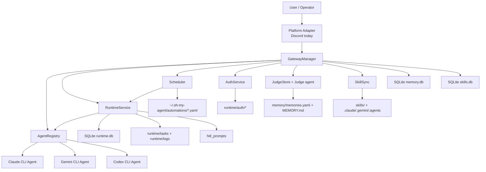
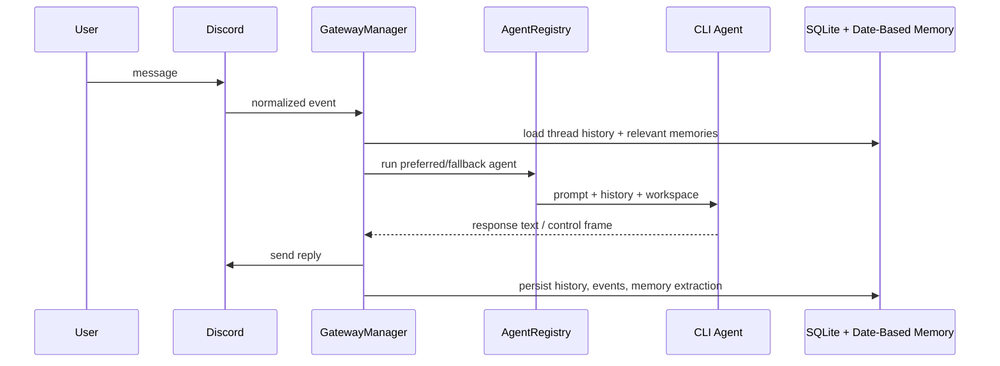
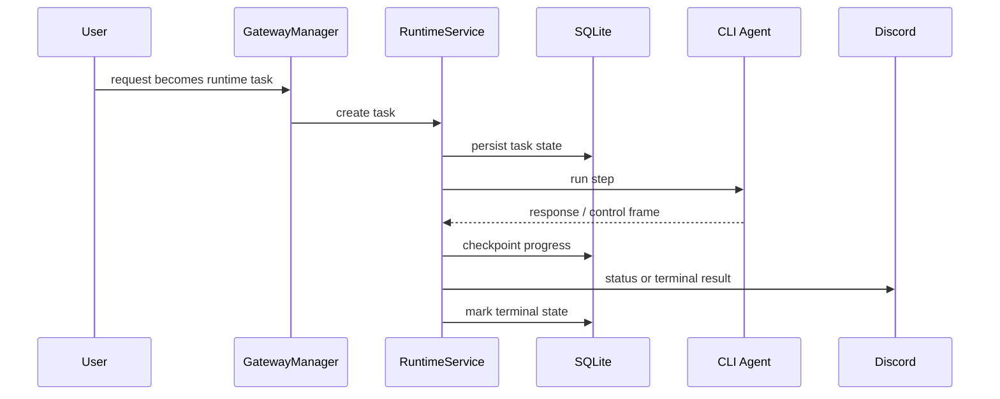
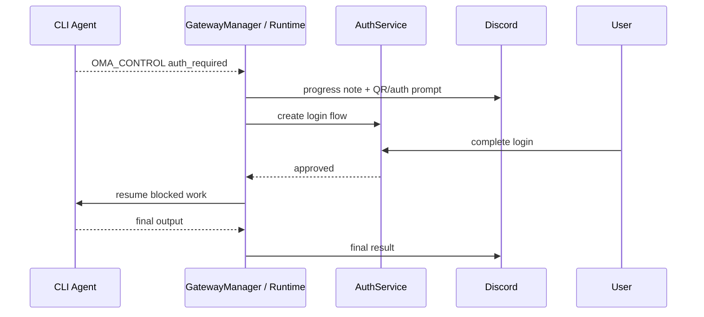
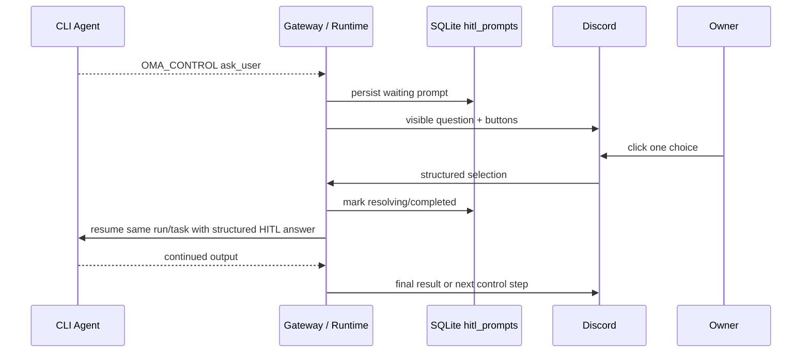
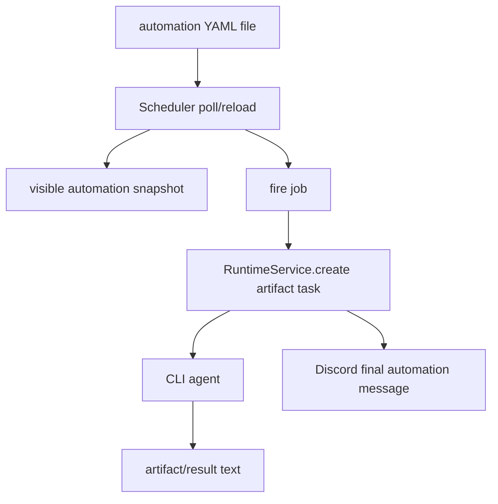

# Architecture

This document describes the current architecture of `oh-my-agent` on the current `main` branch.

It focuses on the code that actually exists today, not an idealized future design.

## Design Goals

- Keep the system CLI-agent-first rather than SDK-agent-first.
- Separate normal chat handling from autonomous runtime task execution.
- Persist enough state to survive restarts without turning every feature into a database-heavy subsystem.
- Keep operator actions available from Discord first.
- Prefer file-driven configuration for things users edit often, such as automations and skills.

## High-Level Component Map



## Main Layers

### 1. Gateway

Primary code:

- `src/oh_my_agent/gateway/manager.py`
- `src/oh_my_agent/gateway/platforms/discord.py`

Responsibilities:

- Accept inbound platform messages and slash commands.
- Maintain per-thread/per-channel interaction state.
- Route requests into one of three paths:
  - direct reply
  - explicit skill invocation
  - runtime task creation
- Surface operator commands such as task control, auth control, memory commands, and automation commands.
- Run the short-workspace janitor for `agent-workspace/sessions`.

The gateway is the coordination layer. It does not itself run agents, execute tasks, or own long-running automation logic.

### 2. Agent Registry and CLI Agents

Primary code:

- `src/oh_my_agent/agents/registry.py`
- `src/oh_my_agent/agents/cli/*.py`

Responsibilities:

- Resolve ordered fallback among configured agents.
- Start or resume CLI sessions for Claude, Gemini, and Codex.
- Stream subprocess output back to the caller.
- Preserve provider-specific session IDs when resume is supported.

This project is deliberately CLI-first. The core abstraction assumes the agent is an external subprocess, not an in-process SDK model.

### 3. Runtime Service

Primary code:

- `src/oh_my_agent/runtime/service.py`
- `src/oh_my_agent/runtime/types.py`

Responsibilities:

- Own the durable task loop for autonomous work.
- Persist task state in the dedicated runtime-state SQLite store.
- Requeue unfinished tasks after restart.
- Execute multi-step task state transitions.
- Handle merge-gated repo work separately from one-shot artifact tasks.
- Pause tasks for auth, resume them later, and emit terminal summaries.
- Pause direct-chat runs or runtime tasks on owner-facing HITL questions and resume them later.
- Clean old runtime task workspaces and agent logs.

Current task families:

- `artifact`
- `repo_change`
- `skill_change`

Important current rule:

- scheduler-triggered automation tasks are intentionally forced into the lightweight `artifact/reply` path rather than the repo-change path.

### 4. Memory

Primary code:

- `src/oh_my_agent/memory/store.py`
- `src/oh_my_agent/memory/date_based.py`
- `src/oh_my_agent/memory/extractor.py`

Responsibilities:

- Store thread history and summaries in `memory.db`.
- Store runtime/auth/HITL/notification/session state in `runtime.db`.
- Store skill provenance and telemetry in `skills.db`.
- Maintain searchable chat history using SQLite FTS.
- Maintain adaptive memory as file-backed daily + curated records.
- Synthesize `MEMORY.md` from curated memory when curated state changes.

Current memory split:

- `memory.db` is the conversation store: `turns`, `summaries`, and `turns_fts*`.
- `runtime.db` is the control-plane store: runtime tasks, auth, HITL prompts, notifications, and agent sessions.
- `skills.db` is the telemetry/governance store: skill provenance, invocations, feedback, and evaluations.
- YAML + Markdown remain the human-editable / human-readable memory surfaces.

### 5. Skills

Primary code:

- `src/oh_my_agent/skills/skill_sync.py`

Responsibilities:

- Treat repo `skills/` as the canonical source.
- Sync skills into CLI-native directories:
  - `.claude/skills`
  - `.gemini/skills`
  - `.agents/skills`
- Refresh workspace skill copies for agents that run inside workspace directories.
- Reverse-import compatible skills from native directories back into canonical storage when requested.

### 6. Auth

Primary code:

- `src/oh_my_agent/auth/service.py`
- `src/oh_my_agent/auth/providers/*.py`
- `src/oh_my_agent/control/protocol.py`

Responsibilities:

- Start provider login flows such as Bilibili QR auth.
- Persist auth artifacts under `~/.oh-my-agent/runtime/auth/`.
- Emit control envelopes (`OMA_CONTROL`) so chat-path or runtime-path agent calls can request login without crashing the whole flow.
- Resume the blocked or waiting work after login completes.

### 7. Automations / Scheduler

Primary code:

- `src/oh_my_agent/automation/scheduler.py`

Responsibilities:

- Load file-driven automations from `~/.oh-my-agent/automations/*.yaml`.
- Maintain a visible automation snapshot for operator commands.
- Poll for file changes and hot-reload jobs.
- Fire jobs on either:
  - `cron`
  - `interval_seconds`
- Enable or disable individual automations by editing the YAML source file.

The scheduler is intentionally file-driven now. `config.yaml` only keeps global automation settings, not inline job definitions.

## Request Paths

### Direct Chat Path



Used for:

- normal replies
- explicit skill invocation that does not need runtime
- direct auth-required interruptions that can resume in-thread

### Runtime Task Path



Used for:

- `repo_change`
- `skill_change`
- scheduler-triggered automation runs

Key distinction:

- `repo_change` and `skill_change` can enter merge-oriented states.
- automation artifact runs are intentionally single-step and post the final result directly.

### Auth Pause / Resume Path



Important current behavior:

- router or scheduler can know about a new skill immediately from canonical files
- a resumed CLI session may still not know about that new skill until it gets a fresh enough prompt/session context

That is a real current limitation and is documented elsewhere in the repo.

### Generic HITL `ask_user` Path



Current v1 scope:

- Discord only
- single-choice buttons only
- owner-only responder
- prompt persists until answered or cancelled
- active button views are rehydrated on restart
- auth remains a separate specialized path

### Automation Path



Current safeguards:

- hot reload is polling-based, not filesystem-event-based
- only one in-flight task per automation name is allowed
- overlapping triggers are skipped, not queued indefinitely

## Storage Layout

```text
~/.oh-my-agent/
├── agent-workspace/
│   └── sessions/               # short conversation workspaces
├── automations/
│   └── *.yaml                  # file-driven automation definitions
├── memory/
│   ├── daily/YYYY-MM-DD.yaml
│   ├── curated.yaml
│   └── MEMORY.md
└── runtime/
    ├── auth/
    ├── logs/
    │   ├── agents/
    │   └── oh-my-agent.log*
    ├── tasks/
    │   ├── _artifacts/<task_id>/
    │   └── <repo-change-task-id>/
    ├── memory.db
    ├── runtime.db
    └── skills.db
```

Store responsibilities:

- `memory.db`: conversation history + FTS
- `runtime.db`: task/auth/HITL/notification/session state
- `skills.db`: skill provenance and telemetry

This split is about physically isolating write hotspots and responsibilities. SQLite still is not a table-level multi-writer database; the point is to stop direct chat history, runtime queue state, and skill telemetry from fighting over one monolithic file and one connection.

## Janitors and Cleanup

There are two different janitor loops.

### Runtime Janitor

Owned by:

- `RuntimeService`

Handles:

- old task workspaces under `runtime/tasks`
- old per-agent logs under `runtime/logs/agents`

Controlled by:

- `runtime.cleanup.*`

Default retention:

- `168` hours (7 days)

### Short-Workspace Janitor

Owned by:

- `GatewayManager`

Handles:

- `agent-workspace/sessions`

Controlled by:

- `short_workspace.*`

These two janitors are intentionally separate because task artifacts and short-lived chat workspaces have different lifecycles.

## Current Design Choices and Tradeoffs

### CLI-first over SDK-first

Reason:

- reuses real Claude/Gemini/Codex tooling
- aligns with how users already work

Tradeoff:

- subprocess orchestration is more fragile than direct SDK calls
- session resume semantics differ by provider
- argument-size and process-lifecycle issues have to be handled explicitly

### File-driven automations

Reason:

- easy to edit manually
- easy to diff in Git or inspect on disk
- supports hot reload cleanly

Tradeoff:

- the scheduler's visible job snapshot still lives in memory and is rebuilt on startup
- invalid or conflicting files are still mostly log-visible, not fully surfaced in operator UI

### Split SQLite + file-backed memory hybrid

Reason:

- separate hot write domains physically:
  - conversation history
  - runtime/control-plane state
  - skill telemetry
- keep SQLite where transactional state and search help
- keep YAML/Markdown where humans need readable/editable memory artifacts

Tradeoff:

- there is still deliberate duplication between transactional runtime state and human-readable memory outputs
- startup migration logic is more complex because old monolithic `memory.db` instances must be split safely into three files

### Runtime vs direct chat split

Reason:

- direct chat should stay cheap and fast
- autonomous tasks need durable state, merge gates, and recovery

Tradeoff:

- there are now two execution surfaces that must stay behaviorally aligned
- auth and skill-awareness bugs often show up at the boundary between them

### Docker source-of-truth model

Current design:

- `/repo` is mounted code/config source of truth
- `/home` is runtime/state
- container start installs `/repo` as editable

Reason:

- avoids stale in-image source copies
- keeps live source edits visible after restart

Tradeoff:

- startup depends on mounted repo integrity
- build-time and run-time responsibilities are intentionally split

## Current Limitations

- resumed CLI sessions do not always immediately recognize newly added skills
- automation operator UI only shows valid visible automations, not invalid/conflicting ones
- automation runtime state (`last_run`, `next_run`, `last_error`) is not yet persisted
- generic HITL v1 is Discord-only and choice-only; there is no free-text or multi-select path yet
- auth still uses its own dedicated suspended-run flow rather than the generic `hitl_prompts` path
- missed-job behavior across downtime is not yet finalized
- lifecycle hooks around agent runs are still only a backlog item, not a system feature yet

## Where to Look in Code

- Entry / wiring: `src/oh_my_agent/main.py`
- Gateway: `src/oh_my_agent/gateway/`
- Agents: `src/oh_my_agent/agents/`
- Runtime: `src/oh_my_agent/runtime/`
- Memory: `src/oh_my_agent/memory/`
- Auth: `src/oh_my_agent/auth/`
- Automations: `src/oh_my_agent/automation/`
- Skills: `src/oh_my_agent/skills/`
