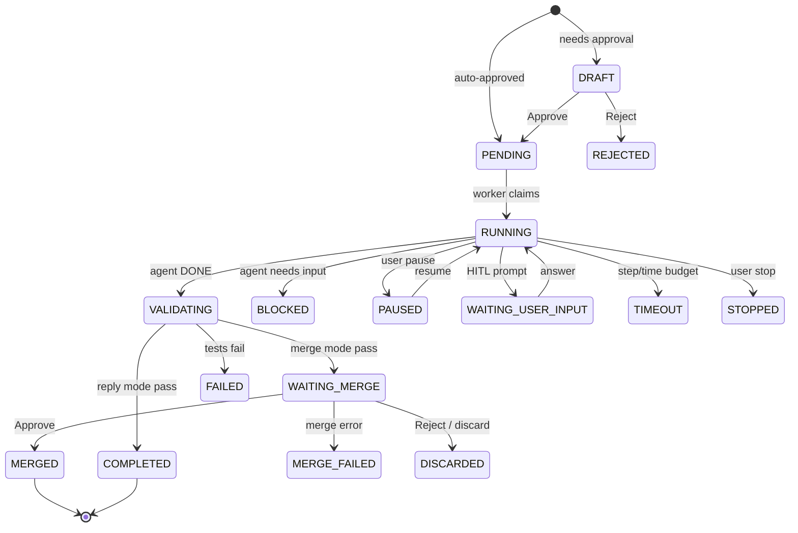

# Task model: types, router intents, state machine

Single source of truth for how a Discord message becomes a runtime task, what kinds of tasks exist, and where their output lives.

---

## 1. Task types

Defined in [`src/oh_my_agent/runtime/types.py`](../../src/oh_my_agent/runtime/types.py).

| Type | Constant | Completion mode | Needs merge | Typical trigger | Workspace |
|---|---|---|---|---|---|
| `artifact` | `TASK_TYPE_ARTIFACT` | `reply` | No | Research, reports, summaries — any deliverable that is not a code change | `~/.oh-my-agent/runtime/tasks/_artifacts/<task_id>/` (isolated, cleaned by janitor) |
| `repo_change` | `TASK_TYPE_REPO_CHANGE` | `merge` | Yes | "Fix X", "refactor Y", "add test for Z" — changes that land on a branch | Git worktree under `~/.oh-my-agent/runtime/tasks/<task_id>/` |
| `skill_change` | `TASK_TYPE_SKILL_CHANGE` | `merge` | Yes (auto-merge if `skill_auto_approve: true`) | "Create a skill for …", "fix the deals skill" | Git worktree, writes under `skills/<name>/` |

Legacy aliases `TASK_TYPE_CODE` and `TASK_TYPE_SKILL` exist for backward compatibility with older stored rows.

---

## 2. Completion modes

| Mode | Constant | Behaviour |
|---|---|---|
| `reply` | `TASK_COMPLETION_REPLY` | Artifact files uploaded to the thread as Discord attachments; completion text includes `Attachments:` and `Archived to:` sections |
| `artifact` | `TASK_COMPLETION_ARTIFACT` | Internal variant; rarely surfaced directly |
| `merge` | `TASK_COMPLETION_MERGE` | Task transitions to `WAITING_MERGE`; owner approves via Discord button or `/task_merge`, which triggers the merge-gate pipeline |

**Archive behaviour (new in v0.9.3 prep)**: when completion mode is `reply`, every artifact file is also copied to `<reports_dir>/artifacts/<filename>`. If the filename already exists, the new copy is suffixed with `-<task_id[:8]>`. Set `runtime.reports_dir: ""` in config to disable archiving.

---

## 3. Router intents

Defined in [`src/oh_my_agent/gateway/router.py`](../../src/oh_my_agent/gateway/router.py). The router is an optional LLM classifier (`router.enabled: true`) that sits in front of message dispatch.

| Decision | Maps to | Confidence gate | Notes |
|---|---|---|---|
| `reply_once` | No task — normal chat | — | Default for casual messages |
| `invoke_existing_skill` | Calls a known skill | `confidence_threshold` (default 0.55) | Router must return a matching `skill_name` |
| `propose_artifact_task` | `artifact` task | ≥ threshold | Runs immediately unless strict-risk guard fires |
| `propose_repo_task` | `repo_change` task | ≥ threshold | Goes through `evaluate_strict_risk()` — may land in `DRAFT` for approval |
| `create_skill` | `skill_change` task (new skill) | ≥ threshold | Router must return `skill_name` as hyphen-case slug |
| `repair_skill` | `skill_change` task (update) | ≥ threshold | Preferred over `create_skill` when recent context shows an existing skill was just used or is being revised |

Below-threshold decisions fall through to `reply_once`. The router also honours `router.require_user_confirm: true` (default), which routes through a confirmation draft for repo/skill tasks.

---

## 4. Status machine

All 17 statuses from [`src/oh_my_agent/runtime/types.py`](../../src/oh_my_agent/runtime/types.py):

| Phase | Statuses |
|---|---|
| Creation | `DRAFT` → `PENDING` |
| Execution | `RUNNING` → `VALIDATING` → `APPLIED` → `COMPLETED` |
| Merge (repo/skill) | `WAITING_MERGE` → `MERGED` (or `MERGE_FAILED`) |
| Human interaction | `BLOCKED`, `PAUSED`, `WAITING_USER_INPUT` |
| Termination | `COMPLETED`, `FAILED`, `TIMEOUT`, `STOPPED`, `REJECTED`, `DISCARDED` |



---

## 5. Message → task flow

```
Discord on_message
  ↓
IncomingMessage (with attachments)
  ↓
GatewayManager.handle_message()
  ├── owner gate (if access.owner_user_ids set)
  ├── create thread if new
  ├── runtime.maybe_handle_thread_context()  (HITL prompt reply?)
  ├── explicit skill? (/<skill_name>)
  └── router enabled AND not explicit:
        router.route(content, context)
        │
        ├── reply_once           → chat path
        ├── invoke_existing_skill → skill dispatch
        ├── propose_artifact_task → create_artifact_task()
        ├── propose_repo_task    → create_task(task_type=repo_change)
        ├── create_skill         → create_skill_task(new=True)
        └── repair_skill         → create_skill_task(new=False)
```

Each `create_*_task` call evaluates `evaluate_strict_risk()` unless `auto_approve=True`. Strict-risk triggers (pip install, deploy, `.env` edits, oversized step/minute budgets) push the task to `DRAFT` instead of `PENDING`.

---

## 6. Artifact delivery path

For `artifact` tasks only:

1. Agent writes files under its isolated workspace (`_artifacts/<task_id>/…`).
2. `_artifact_paths_for_task()` resolves them against `task.artifact_manifest` or fallback `changed_files`.
3. `_archive_artifact_files()` copies each file to `<reports_dir>/artifacts/`. Filename collisions get a `-<task_id[:8]>` suffix. Failures are logged and non-fatal.
4. `deliver_files()` uploads the originals as Discord attachments (file-size guards: `artifact_attachment_max_count`, `artifact_attachment_max_bytes`, `artifact_attachment_max_total_bytes`).
5. Completion message renders `Attachments:` + `Archived to:`. If upload fails, delivery degrades to `mode="path"` with absolute local paths.
6. Janitor (`runtime.cleanup.retention_hours`, default 168 h) eventually deletes the task workspace. The archived copy under `reports_dir/` is **not** auto-cleaned.

---

## 7. Known sharp edges

1. **Router threshold is 0.55.** A casual phrase like "帮我研究一下 X / let me research X" clears the bar. If you want chat, either disable the router for that thread or rephrase. Raise `router.confidence_threshold` to trade recall for precision.
2. **Artifact workspace has no bundled skills.** The isolated `_artifacts/<id>/` directory does not get `.claude/skills/` or `.gemini/skills/` populated, so a `research` artifact task cannot invoke, say, a `web-scraper` skill — the agent must inline all work. (Repo-change tasks *do* get skills via `_setup_workspace()`.)
3. **Default budget `max_steps=8 / max_minutes=20`.** Fine for a single-turn report but tight for multi-source research. Override per automation or per skill frontmatter, or call `create_artifact_task(max_steps=…)` from custom code.
4. **Silent fallback to `mode="path"`.** When attachment upload fails (network, size), the completion message says `Delivery mode: path` with local paths — easy to miss in a busy thread. The archived copy remains in `reports_dir/` regardless.
5. **Archive retention is manual.** `reports_dir` never auto-prunes. Plan for periodic sweeps (`find ~/.oh-my-agent/reports -mtime +90 -delete`) if disk usage matters.
6. **Docker volume mapping.** Inside the container artifacts land at `/home/.oh-my-agent/reports/artifacts/`; from the host they surface at `${OMA_DOCKER_MOUNT:-~/oh-my-agent-docker-mount}/.oh-my-agent/reports/artifacts/`.

---

## 8. Related config keys

```yaml
runtime:
  worktree_root: ~/.oh-my-agent/runtime/tasks
  reports_dir: ~/.oh-my-agent/reports    # artifact archive; set to "" to disable
  default_max_steps: 8
  default_max_minutes: 20
  artifact_attachment_max_count: 5
  artifact_attachment_max_bytes: 8388608           # 8 MiB per file
  artifact_attachment_max_total_bytes: 20971520    # 20 MiB total

router:
  enabled: false
  confidence_threshold: 0.55
  require_user_confirm: true
```

See [config-reference.md](config-reference.md) for the full list.
