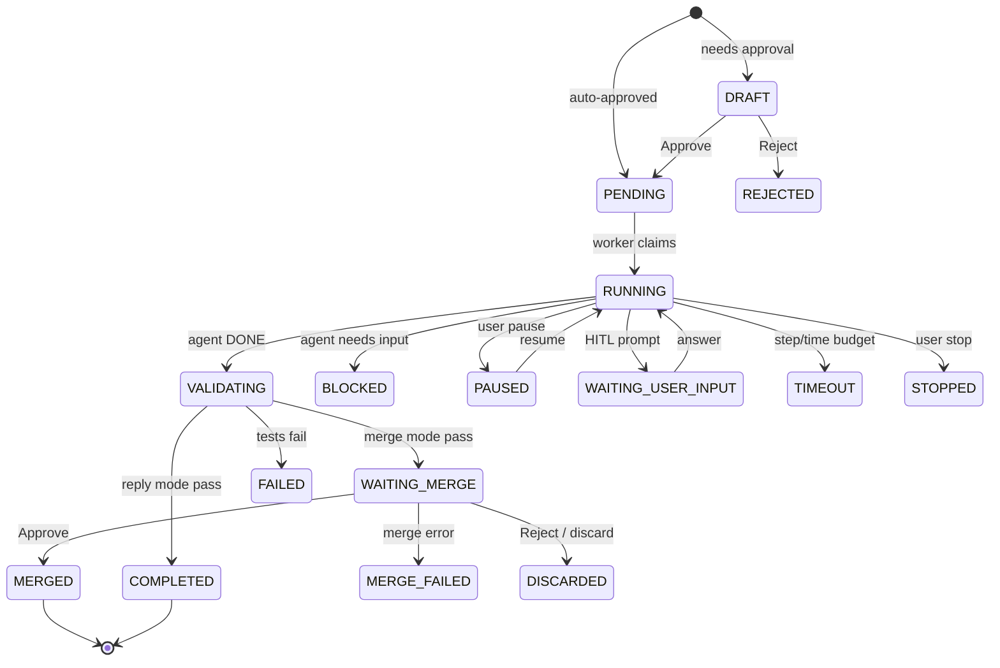

# Task model: types, router intents, state machine

Single source of truth for how a Discord message becomes a runtime task, what kinds of tasks exist, and where their output lives.

---

## 1. Task types

Defined in [`src/oh_my_agent/runtime/types.py`](../../src/oh_my_agent/runtime/types.py).

| Type | Constant | Completion mode | Needs merge | Typical trigger | Workspace |
|---|---|---|---|---|---|
| `artifact` | `TASK_TYPE_ARTIFACT` | `reply` | No | Research, reports, summaries — any deliverable that is not a code change | `~/.oh-my-agent/runtime/tasks/_artifacts/<task_id>/` (isolated, cleaned by janitor) |
| `repo_change` | `TASK_TYPE_REPO_CHANGE` | `merge` | Yes | "Fix X", "refactor Y", "add test for Z" — changes that land on a branch | Git worktree under `~/.oh-my-agent/runtime/tasks/<task_id>/` |
| `skill_change` | `TASK_TYPE_SKILL_CHANGE` | `merge` | Yes (auto-merge if `skill_auto_approve: true`) | "Create a skill for …", "fix the deals skill" | Git worktree, writes under `skills/<name>/` |

Legacy aliases `TASK_TYPE_CODE` and `TASK_TYPE_SKILL` exist for backward compatibility with older stored rows.

---

## 2. Completion modes

| Mode | Constant | Behaviour |
|---|---|---|
| `reply` | `TASK_COMPLETION_REPLY` | Artifact files uploaded to the thread as Discord attachments; completion text prioritises a `Published to:` line (absolute path) and demotes transport detail (`Delivered via:` / scratch dir) to subordinate labels |
| `artifact` | `TASK_COMPLETION_ARTIFACT` | Internal variant; rarely surfaced directly |
| `merge` | `TASK_COMPLETION_MERGE` | Task transitions to `WAITING_MERGE`; owner approves via Discord button or `/task_merge`, which triggers the merge-gate pipeline |

**Publish behaviour**: each delivered file is published to a single stable location under `runtime.reports_dir/...`. Four rules (applied in order):

1. **Reuse in place** — if the resolved source is already under `reports_dir/` and *not* under the task workspace, the published path is the source itself (no copy).
2. **Canonical mirror** — if the source lives under `workspace_path/reports/<sub-tree>/…`, publish at `reports_dir/<sub-tree>/…` preserving structure. Canonical collisions **overwrite in place, no suffix** (same logical path = same file).
3. **Flat fallback (workspace, non-reports)** — workspace files whose relative path does not start with `reports/` land at `reports_dir/artifacts/<basename>`. Basename collisions get a `-<task_id[:8]>` suffix.
4. **Flat fallback (external absolute)** — absolute paths outside both `workspace_path` and `reports_dir` (rare — e.g. explicit `artifact_manifest` pointing outside the worktree) follow the same flat rule as (3).

Set `runtime.reports_dir: ""` to disable publishing entirely. `_artifacts/<task_id>/` stays ephemeral scratch and is cleaned by the janitor; the published tree under `reports_dir/` is never auto-pruned.

---

## 3. Router intents

Defined in [`src/oh_my_agent/gateway/router.py`](../../src/oh_my_agent/gateway/router.py). The router is an optional LLM classifier (`router.enabled: true`) that sits in front of message dispatch.

| Decision | Maps to | Confidence gate | Notes |
|---|---|---|---|
| `reply_once` | No task — normal chat | — | Default for casual messages |
| `invoke_existing_skill` | Calls a known skill | `confidence_threshold` (default 0.55) | Router must return a matching `skill_name` |
| `propose_artifact_task` | `artifact` task | ≥ threshold | Runs immediately unless strict-risk guard fires |
| `propose_repo_task` | `repo_change` task | ≥ threshold | Goes through `evaluate_strict_risk()` — may land in `DRAFT` for approval |
| `create_skill` | `skill_change` task (new skill) | ≥ threshold | Router must return `skill_name` as hyphen-case slug |
| `repair_skill` | `skill_change` task (update) | ≥ threshold | Preferred over `create_skill` when recent context shows an existing skill was just used or is being revised |

Below-threshold decisions fall through to `reply_once`. The router also honours `router.require_user_confirm: true` (default), which routes through a confirmation draft for repo/skill tasks.

---

## 4. Status machine

All 17 statuses from [`src/oh_my_agent/runtime/types.py`](../../src/oh_my_agent/runtime/types.py):

| Phase | Statuses |
|---|---|
| Creation | `DRAFT` → `PENDING` |
| Execution | `RUNNING` → `VALIDATING` → `APPLIED` → `COMPLETED` |
| Merge (repo/skill) | `WAITING_MERGE` → `MERGED` (or `MERGE_FAILED`) |
| Human interaction | `BLOCKED`, `PAUSED`, `WAITING_USER_INPUT` |
| Termination | `COMPLETED`, `FAILED`, `TIMEOUT`, `STOPPED`, `REJECTED`, `DISCARDED` |



---

## 5. Message → task flow

```
Discord on_message
  ↓
IncomingMessage (with attachments)
  ↓
GatewayManager.handle_message()
  ├── owner gate (if access.owner_user_ids set)
  ├── create thread if new
  ├── runtime.maybe_handle_thread_context()  (HITL prompt reply?)
  ├── explicit skill? (/<skill_name>)
  └── router enabled AND not explicit:
        router.route(content, context)
        │
        ├── reply_once           → chat path
        ├── invoke_existing_skill → skill dispatch
        ├── propose_artifact_task → create_artifact_task()
        ├── propose_repo_task    → create_task(task_type=repo_change)
        ├── create_skill         → create_skill_task(new=True)
        └── repair_skill         → create_skill_task(new=False)
```

Each `create_*_task` call evaluates `evaluate_strict_risk()` unless `auto_approve=True`. Strict-risk triggers (pip install, deploy, `.env` edits, oversized step/minute budgets) push the task to `DRAFT` instead of `PENDING`.

---

## 6. Artifact delivery path

For `artifact` tasks only:

1. Agent writes files under its isolated workspace (`_artifacts/<task_id>/…` for reply-mode tasks, or under the worktree's `reports/<skill>/…` sub-tree for skills that publish to a stable path).
2. `_artifact_paths_for_task()` resolves them against `task.artifact_manifest` or fallback `changed_files`.
3. `_publish_artifact_files()` applies the four publish rules (see §2 above): reuse in place when already under `reports_dir`, mirror canonical `reports/<sub-tree>/…` paths (overwrite, no suffix), or fall back to flat `reports_dir/artifacts/<basename>` with a `-<task_id[:8]>` suffix on basename collisions. Failures are logged and non-fatal.
4. `deliver_files()` uploads the originals as Discord attachments (file-size guards: `artifact_attachment_max_count`, `artifact_attachment_max_bytes`, `artifact_attachment_max_total_bytes`).
5. Completion message renders `Published to: <absolute path>` as the primary line, with `Delivered via: <mode>` (and an optional `Scratch (ephemeral): _artifacts/<task_id>/` label) as subordinate detail. If upload fails, delivery degrades to `mode="path"` — the published path is still rendered as primary.
6. Janitor (`runtime.cleanup.retention_hours`, default 168 h) eventually deletes the task workspace. The published tree under `reports_dir/` is **not** auto-cleaned.

---

## 7. Failure recovery: retry + rerun button

Only the **runtime task path** (`/task_start` + automations). Chat-path `AgentRegistry.run()` (from `/ask` or slash skills) has no retry layer — those users retry manually.

### 7.1 Transparent retry by `error_kind`

`RuntimeService._invoke_agent_with_retry` classifies every agent outcome into an `error_kind` and retries transient kinds before letting the result propagate to the `AgentRegistry` fallback loop:

| `error_kind` | Action | Backoff | Cap |
|---|---|---|---|
| success | return | — | — |
| `rate_limit` | retry | 10 s → 30 s | 2 attempts |
| `api_5xx` | retry | 5 s → 15 s | 2 attempts |
| `timeout` | retry once | 0 s (immediate) | 1 attempt |
| `max_turns` | **terminal** | — | 0 (surfaces re-run button) |
| `auth` | **terminal** | — | 0 (triggers auth notification) |
| `cli_error` | **terminal** | — | 0 (fallback to next agent) |

Total retries across kinds are capped at `_MAX_TOTAL_RETRIES = 3` per agent invocation. Each retry logs `Runtime task=<id> retry=<n>/<max> kind=<k>` and records a `task.agent_retry` event. Retry counters do not carry across agents — a fallback from claude → codex gets a fresh retry budget.

### 7.2 "Re-run +30 turns" button on `max_turns` failures

When an agent returns `error_kind=max_turns`, the runtime treats it as terminal (retrying blindly just wastes the same budget again). Instead, `_fail` posts an interactive decision surface:

```
@owner Task `abc123…` hit `max_turns` (25). Re-run with `max_turns=55`?
_Button expires in ~24h._
[ Re-run +30 turns ]
```

Clicking the button:

1. Consumes the decision nonce (TTL = `runtime.decision_ttl_minutes`, default 1440).
2. Creates a **sibling task** that clones the parent (`goal`, `preferred_agent`, `completion_mode`, `automation_name`, `skill_name`, `task_type`, `test_command`) but with `agent_max_turns = parent.agent_max_turns + 30` (fallback base 25 if parent left it unset).
3. Emits `task.rerun_sibling_created` on the parent (with `sibling_task_id`, `base_turns`, `agent_max_turns`, `actor_id`, `source`) and `task.created` on the sibling (with `parent_task_id`, `source="rerun_bump_turns:button"`).
4. Puts the sibling into `PENDING` so the normal dispatch loop claims it.

Bumping the skill's `metadata.max_turns` in `SKILL.md` is still preferred — the button is a one-shot rescue, not a permanent fix.

---

## 8. HITL decisions on DRAFT / WAITING_MERGE tasks

Tasks in `DRAFT` (pre-approval) or `WAITING_MERGE` (merge-gate) surface an interactive decision message with buttons. The owner can act via Discord buttons or the matching slash command; both paths converge on `TaskService.decide()` → `RuntimeService.handle_decision_event()`.

| Action | Buttons | Slash | Applies to |
|---|---|---|---|
| approve | `Approve` | `/task_approve` | DRAFT → PENDING; WAITING_MERGE → merge pipeline |
| reject | `Reject` | `/task_reject` | DRAFT → REJECTED; WAITING_MERGE → DISCARDED |
| suggest | `Suggest` (opens modal) | `/task_suggest` | DRAFT: keeps draft, stores resume instruction + optional budget overrides for next run. WAITING_MERGE: promoted to `request_changes`, which re-opens the task as BLOCKED for follow-up work |
| merge | `Merge` | `/task_merge` | WAITING_MERGE → MERGED |
| discard | `Discard` | `/task_discard` | WAITING_MERGE → DISCARDED |

### 8.1 `/task_suggest` budget overrides (per-call, not outer loop)

Both the `Suggest` button (via modal) and the `/task_suggest` slash command accept optional `max_turns` and `timeout_seconds` arguments that override the **per-agent-call** budget for the next execution:

- **Slash**: `/task_suggest task_id:<id> suggestion:"<text>" max_turns:<int> timeout_seconds:<int>`. Discord enforces `max_turns ∈ [1, 500]` and `timeout_seconds ∈ [1, 86400]` via `app_commands.Range`.
- **Button**: Clicking `Suggest` opens a Discord modal with three fields — suggestion (required, up to 2000 chars), max_turns (optional, positive integer), timeout_seconds (optional, positive integer). Strict integer validation: non-integer or `≤ 0` inputs surface an ephemeral error and the decision is not applied.

When overrides are present, `handle_decision_event` writes them onto the task row (`agent_max_turns`, `agent_timeout_seconds`) via `update_runtime_task(...)` before re-queueing. The next run honors the new budget via `AgentRegistry._temporary_max_turns` / `_temporary_timeout` — no subprocess IPC needed. The `task.suggested` event payload records `max_turns_override` and `timeout_seconds_override` for audit. A `Per-call budget override: max_turns → … · timeout → …s` line is appended to the surfaced suggestion text so the owner can confirm the new budget.

**Two-layer budget — common source of confusion.** The runtime has two nested budget systems:

| Layer | Field(s) | Meaning | Shown in logs as |
|---|---|---|---|
| Outer (runtime loop) | `max_steps`, `max_minutes` | How many agent invocations the `RuntimeService` will make across the life of this task | `step=N/M` |
| Inner (per agent call) | `agent_max_turns`, `agent_timeout_seconds` | Passed to each individual agent subprocess (Claude `--max-turns`, timeout seconds) | Not directly surfaced; claude exits with `error_max_turns` if hit |

`/task_suggest` only mutates the **inner** layer. Seeing `step=1/8` after setting `max_turns=30` is expected — the 8 is the outer counter and this override does not touch it. If you need a bigger outer budget, resubmit via `/task_start` with higher `max_steps` / `max_minutes`, or bump the skill's `metadata.max_turns` / `timeout_seconds` in `SKILL.md`.

---

## 9. Known sharp edges

1. **Router threshold is 0.55.** A casual phrase like "帮我研究一下 X / let me research X" clears the bar. If you want chat, either disable the router for that thread or rephrase. Raise `router.confidence_threshold` to trade recall for precision.
2. **Artifact workspace has no bundled skills.** The isolated `_artifacts/<id>/` directory does not get `.claude/skills/` or `.gemini/skills/` populated, so a `research` artifact task cannot invoke, say, a `web-scraper` skill — the agent must inline all work. (Repo-change tasks *do* get skills via `_setup_workspace()`.)
3. **Default budget `max_steps=8 / max_minutes=20`.** Fine for a single-turn report but tight for multi-source research. Override per automation or per skill frontmatter, or call `create_artifact_task(max_steps=…)` from custom code.
4. **Silent fallback to `mode="path"`.** When attachment upload fails (network, size), delivery degrades to `mode="path"` and the transport label reads `Delivered via: path` — easy to miss in a busy thread. The `Published to:` line still points to the durable absolute path under `reports_dir/`.
5. **Publish retention is manual.** `reports_dir` never auto-prunes. Plan for periodic sweeps (`find ~/.oh-my-agent/reports -mtime +90 -delete`) if disk usage matters.
6. **Docker volume mapping.** Inside the container published artifacts land under `/home/.oh-my-agent/reports/<sub-tree>/…` (or `artifacts/` for flat-fallback cases); from the host they surface at `${OMA_DOCKER_MOUNT:-~/oh-my-agent-docker-mount}/.oh-my-agent/reports/…`.

---

## 10. Related config keys

```yaml
runtime:
  worktree_root: ~/.oh-my-agent/runtime/tasks
  reports_dir: ~/.oh-my-agent/reports    # published artifact tree; set to "" to disable publishing
  default_max_steps: 8
  default_max_minutes: 20
  artifact_attachment_max_count: 5
  artifact_attachment_max_bytes: 8388608           # 8 MiB per file
  artifact_attachment_max_total_bytes: 20971520    # 20 MiB total

router:
  enabled: false
  confidence_threshold: 0.55
  require_user_confirm: true
```

See [config-reference.md](config-reference.md) for the full list.
