# Todo / Roadmap

Items are organized by target version. Each feature annotates its dependencies with `⬅ depends on`.

See [future_planning_discussion.md](future_planning_discussion.md) for detailed rationale behind these decisions.

---

## Feature Dependency Graph

```mermaid
graph TD
    %% ── v0.3.0 (Done) ──────────────────────────────
    MEM["✅ Memory (SQLite + FTS5)"]
    COMP["✅ History Compression"]
    SKILL["✅ Skill System (SkillSync)"]
    FALLBACK["✅ Agent Registry Fallback"]

    %% ── v0.4.0 ─────────────────────────────────────
    DEPRECATE["Deprecate API Agents"]
    CODEX["Add Codex CLI Agent"]
    SANDBOX["Enable CLI Sandbox Modes"]
    WRITE["Add Write to Claude Tools"]
    REVERSE["SkillSync Reverse Sync"]
    STREAM["Streaming Responses"]
    SLASH["Slash Commands"]
    README["Update README"]

    %% ── v0.5.0 ─────────────────────────────────────
    SKILLCREATE["Agent-Driven Skill Creation"]
    SKILLTEST["Skill Testing / Validation"]
    RESUME["CLI Session Resume"]
    XMEM["Cross-Session Memory Search"]
    MEMIO["Memory Export/Import"]

    %% ── v0.6.0 ─────────────────────────────────────
    ROUTING["Smart Agent Routing"]
    COLLAB["Agent Collaboration"]
    MENTION["Agent Selection @mention"]

    %% ── Backlog ─────────────────────────────────────
    DOCKER["Docker-Based Isolation"]
    RATELIMIT["Rate Limiting"]

    %% ── Dependencies ────────────────────────────────

    %% v0.4 internal
    SANDBOX -->|"Codex sandbox = --full-auto"| CODEX
    DEPRECATE --> README
    CODEX --> README

    %% v0.4 → v0.5
    REVERSE --> SKILLCREATE
    WRITE --> SKILLCREATE
    SKILL --> REVERSE
    SKILLCREATE --> SKILLTEST
    SLASH -->|"/search command"| XMEM
    MEM --> XMEM
    MEM --> MEMIO
    COMP --> RESUME

    %% v0.5 → v0.6
    CODEX --> ROUTING
    FALLBACK --> ROUTING
    ROUTING --> COLLAB
    ROUTING --> MENTION
    SLASH -->|"/agent command"| MENTION

    %% Backlog
    SANDBOX --> DOCKER
    CODEX -->|"multi-agent needed"| RATELIMIT

    %% Style
    classDef done fill:#2d6a4f,stroke:#1b4332,color:#fff
    classDef v04 fill:#1d3557,stroke:#457b9d,color:#fff
    classDef v05 fill:#6a040f,stroke:#9d0208,color:#fff
    classDef v06 fill:#7b2cbf,stroke:#9d4edd,color:#fff
    classDef backlog fill:#495057,stroke:#6c757d,color:#fff

    class MEM,COMP,SKILL,FALLBACK done
    class DEPRECATE,CODEX,SANDBOX,WRITE,REVERSE,STREAM,SLASH,README v04
    class SKILLCREATE,SKILLTEST,RESUME,XMEM,MEMIO v05
    class ROUTING,COLLAB,MENTION v06
    class DOCKER,RATELIMIT backlog
```



### Dependency Summary

| Feature | Hard Dependencies | Soft / Recommended |
|---------|------------------|--------------------|
| **Deprecate API agents** | None (independent) | — |
| **Add Codex CLI agent** | None (independent) | — |
| **Enable CLI sandbox** | Codex agent (sandbox config is part of Codex `_build_command`) | — |
| **Add `Write` to Claude tools** | None (config change only) | — |
| **SkillSync reverse sync** | ✅ Skill System (v0.3) | — |
| **Streaming responses** | None (independent) | — |
| **Slash commands** | None (independent, but `/search` only useful after cross-session memory) | Cross-session memory |
| **Update README** | Deprecate API agents, Add Codex (wait for arch to settle) | — |
| **Agent-driven skill creation** | ⬅ SkillSync reverse sync, ⬅ Add `Write` to Claude tools | Skill testing |
| **Skill testing / validation** | ⬅ Agent-driven skill creation | — |
| **CLI session resume** | ✅ History Compression (v0.3) | — |
| **Cross-session memory search** | ✅ Memory (v0.3), ⬅ Slash commands (`/search`) | — |
| **Memory export/import** | ✅ Memory (v0.3) | — |
| **Smart agent routing** | ✅ Agent Registry (v0.3), ⬅ Add Codex (need ≥3 agents) | — |
| **Agent collaboration** | ⬅ Smart agent routing | — |
| **Agent selection @mention** | ⬅ Smart agent routing, ⬅ Slash commands (`/agent`) | — |
| **Docker-based isolation** | ⬅ Enable CLI sandbox (understand CLI-level first) | — |
| **Rate limiting** | ⬅ Add Codex (multi-agent concurrency increases load) | — |

### Critical Paths

```
Path 1 (Self-Evolution):
  Skill System (✅) → SkillSync Reverse Sync → Agent-Driven Skill Creation → Skill Testing
                       Write Tool (config) ───↗

Path 2 (Multi-Agent Intelligence):
  Codex CLI Agent ──→ Smart Agent Routing → Agent Collaboration
  Agent Registry (✅) ↗                   → Agent Selection @mention
                                             ↑
  Slash Commands (/agent) ──────────────────↗

Path 3 (Memory Evolution):
  Memory (✅) → Cross-Session Memory Search ← Slash Commands (/search)
             → Memory Export/Import
```

### Parallelizable Work (No Dependencies)

These features can be worked on **immediately and in parallel** — no blockers:

1. Deprecate API agents
2. Add Codex CLI agent
3. Add `Write` to Claude allowed_tools (config change)
4. Streaming responses
5. Slash commands
6. CLI session resume
7. Memory export/import

---

## v0.4.0 — CLI-First Cleanup + Skill Sync

- [x] **Deprecate API agent layer** — `agents/api/` marked deprecated with warnings. Removed from `config.yaml.example`.
- [x] **Add `Write` to Claude allowed_tools** — config updated to `[Bash, Read, Write, Edit, Glob, Grep]`.
- [x] **Add Codex CLI agent** — `agents/cli/codex.py` using `codex exec --full-auto`.
- [ ] **Enable CLI sandbox modes** — Codex: `--full-auto` (included by default). Gemini: add `--sandbox`. Claude: monitor for `--sandbox` flag.
- [x] **SkillSync reverse sync** — `SkillSync.reverse_sync()` detects new skills in CLI dirs, copies back to `skills/`. `full_sync()` runs both directions on startup.
- [x] **Streaming responses** — `ClaudeAgent` supports `--output-format stream-json`. Discord messages edited in-place with rate-limited updates.
- [x] **Slash commands** — `/ask`, `/reset`, `/agent`, `/search` via `discord.app_commands`.
- [x] **CLI session resume** — `ClaudeAgent` tracks session IDs per thread, uses `--resume` for subsequent messages.
- [x] **Memory export/import** — `MemoryStore.export_data()` / `import_data()` for JSON backup/restore.
- [x] **Update README.md** — rewritten for v0.4.0 CLI-first architecture.

## v0.5.0 — Self-Evolution

- [ ] **Agent-driven skill creation** — user requests skill → agent creates it → auto sync. *(⬅ depends on: ✅ SkillSync reverse sync, ✅ Write tool)*
- [ ] **Skill testing / validation** — auto-verify newly created skills. *(⬅ depends on: Agent-driven skill creation)*
- [ ] **Cross-session memory search** — FTS5 search across threads via `/search`. *(⬅ depends on: ✅ Memory v0.3, ✅ Slash commands `/search`)*

## v0.6.0 — Multi-Agent Intelligence

- [ ] **Smart agent routing** — route by task type instead of simple fallback. *(⬅ depends on: ✅ Agent Registry v0.3, Add Codex — need ≥3 agents for routing to matter)*
- [ ] **Agent collaboration** — multi-agent workflows (write + review). *(⬅ depends on: Smart agent routing)*
- [ ] **Agent selection via @mention** — `@claude fix this`. *(⬅ depends on: Smart agent routing, Slash commands `/agent`)*
- [ ] **Telegram adapter** — `gateway/platforms/telegram.py`. *(independent from agent features)*
- [ ] **Feishu/Lark adapter** — `gateway/platforms/feishu.py`. *(independent from agent features)*

## Backlog (Unprioritized)

- [ ] **Slack adapter** — implement `slack_sdk` async client. *(independent)*
- [ ] **Rate limiting / request queue** — per-session queue. *(⬅ soft dependency: Add Codex — more agents = more concurrency pressure)*
- [ ] **File attachment support** — download Discord attachments, pass to agent. *(independent)*
- [ ] **Markdown-aware chunking** — track code fence state in `chunker.py`. *(independent)*
- [ ] **SQLite → PostgreSQL migration** — swap `MemoryStore` backend. *(⬅ depends on: ✅ Memory v0.3, recommended after Memory export/import)*
- [ ] **End-to-end test with real Discord** — integration test against real server. *(independent)*
- [ ] **Docker-based agent isolation** — run CLI agents in containers. *(⬅ depends on: Enable CLI sandbox — understand CLI-level isolation first)*

## Maintenance / Quality

- [ ] **Linting / formatting** — add `ruff` to dev deps. *(independent)*
- [ ] **Type checking** — add `mypy` or `pyright`. *(independent)*
- [ ] **GitHub Actions CI** — `pytest` on push/PR. *(⬅ soft dependency: Linting/formatting — nice to lint in CI too)*

## Done (v0.3.0)

- [x] **Conversation memory within threads** — `MemoryStore` with SQLite backend.
- [x] **Memory compression** — `HistoryCompressor` auto-summarises old turns.
- [x] **Skill system** — `SkillSync` symlinks to CLI native dirs.
- [x] **Gemini CLI model update** — `gemini-3-flash-preview`.
- [x] **Gemini fallback** — `agents: [claude, gemini]` with ordered fallback.
